# Exercise 1: Analyst Agent

### Estimated Duration: 20 Minutes

## Lab Overview

In this lab, you will use the **Microsoft 365 Copilot Analyst agent** to analyze and visualize survey results from an internal initiative called **Project Nexus**. The Analyst agent enables you to interpret structured datasets, generate quantitative and qualitative insights, identify trends, and create visualizations using AI-powered analysis directly within Microsoft 365 Copilot.

You will upload a survey dataset, explore trends, calculate averages, generate charts, and produce a stakeholder-ready summary report. This lab demonstrates how AI can accelerate data analysis and transform raw survey responses into actionable insights.

## Lab Objectives

In this exercise, you will complete the following tasks:

- Task 1: Upload the Dataset and Analyze Survey Results Using the Analyst Agent

## Task 1: Upload the Dataset and Analyze Survey Results Using the Analyst Agent

In this task, you'll open Microsoft 365 Copilot, upload the Project Nexus survey dataset, and use the Analyst agent to analyze the data, identify trends, generate insights, and create visualizations.

1. On the **labvm** desktop, double-click the **M365-Copilot** icon.

    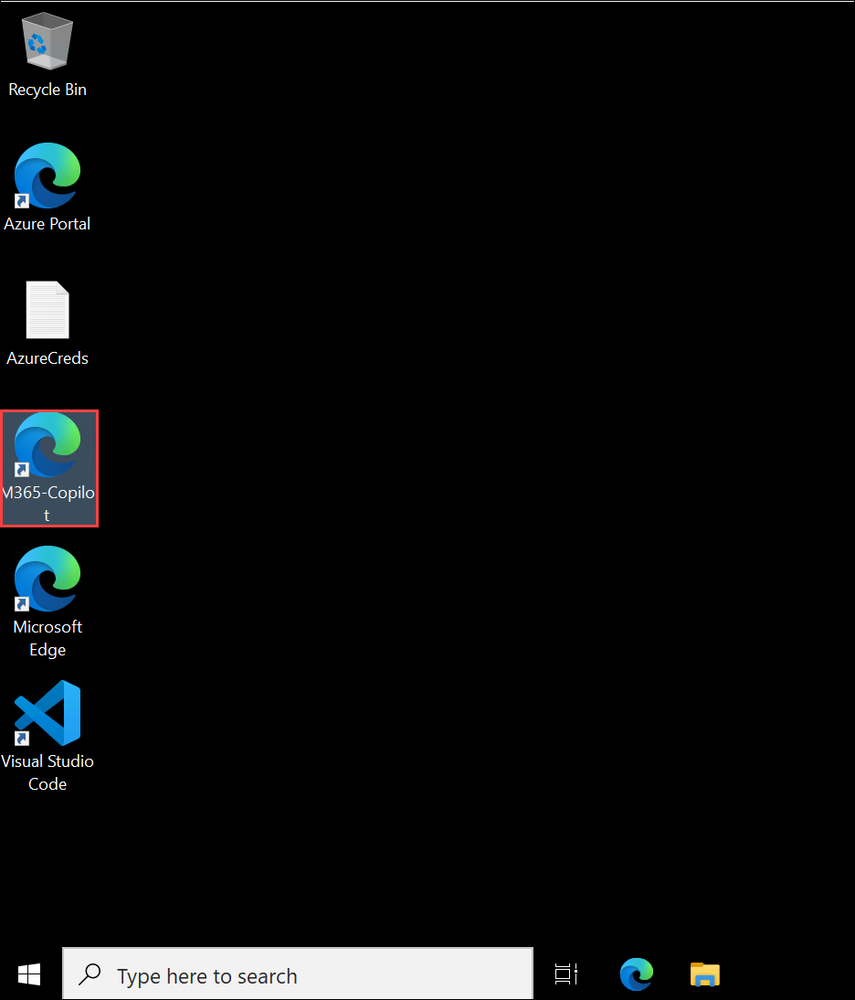

3. If prompted, sign in using the following credentials:

    - **Username:** Enter **<inject key="AzureAdUserEmail"></inject>** **(1)**, then click on **Next (2)**.

        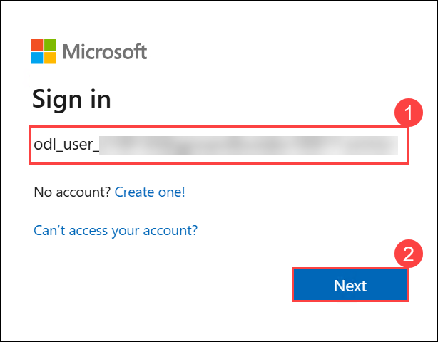

    - **Password:** Enter **<inject key="AzureAdUserPassword"></inject>** **(1)** and then click on **Sign in (2)**.

        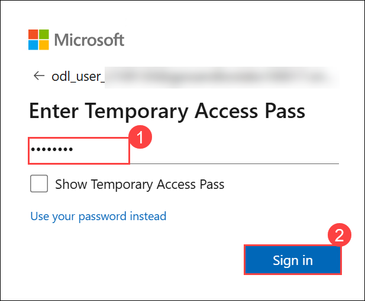

1. On the **Stay signed in?**, click **Yes**.

    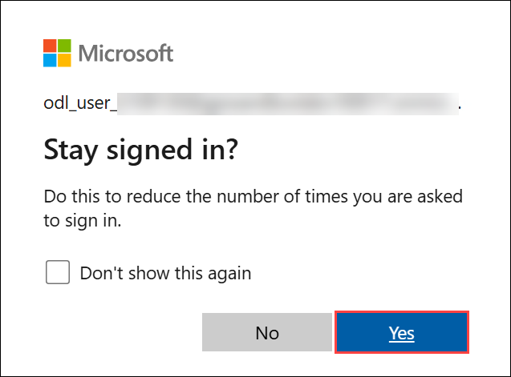

1. You will be redirected to the **Microsoft 365** homepage.

    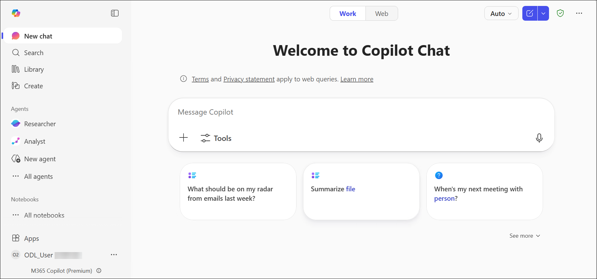

4. From the left navigation pane, select **Analyst** under the **Agents** section.

    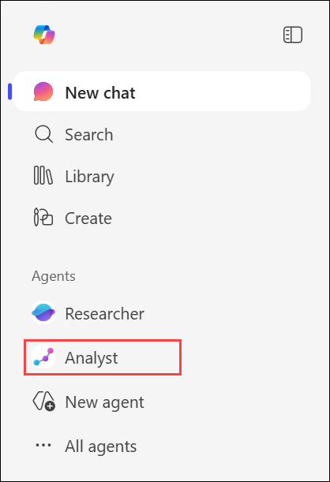

1. In the prompt field, select the **+ (Add content) (1)** icon and then select **Upload images and files (2)**.

    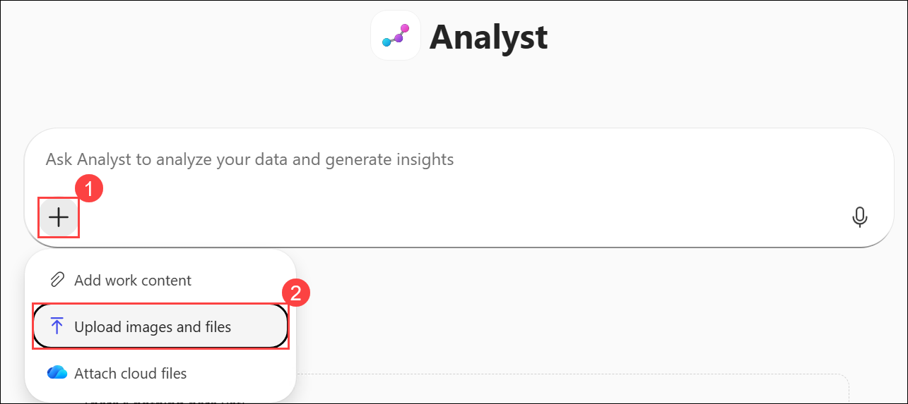

1. Navigate to `C:\AllFiles\Project-Nexus` **(1)** and select **Project_Nexus_survey_results.xlsx (2)** and then click on **Open (3)**.

    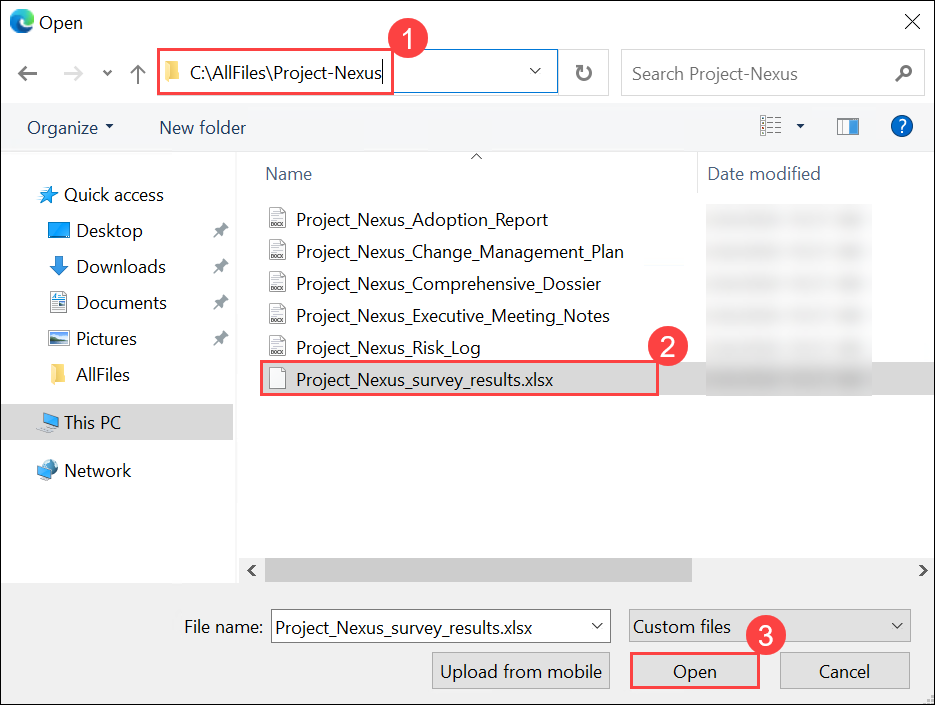

5. Once the **Project_Nexus_survey_results.xlsx** is added, in the prompt field, enter the following prompt **(1)** and then click on the arrow icon **(2)**:

    ```
    Analyze this spreadsheet and tell me the top three trends.
    ```

    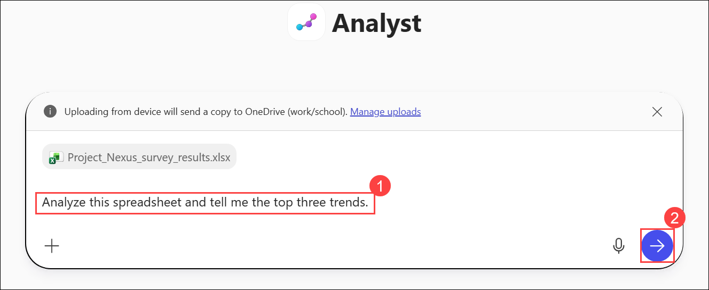

6. Wait for the Analyst agent to process the data, then review the results.

    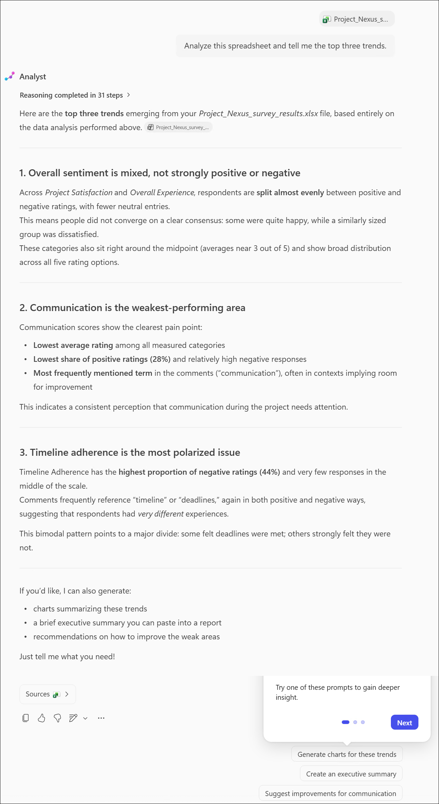

    > **Note:** Note how Analyst runs several Python commands to come up with its final list of trends. You might have to wait a minute or so for it to complete all the commands so that it can aggregate the results and determine the top three trends. Below each command is a description of the results of that command. Continue to scroll down through the results to see the top three trends.

    > **Note:** The responses generated by Copilot agents may vary depending on the prompt interpretation and the available data. As a result, the output you receive may differ from the examples shown in the images.

1. To gain deeper insights into each category, enter the following prompt:

    ```
    What is the average rating for each survey category?
    ```

    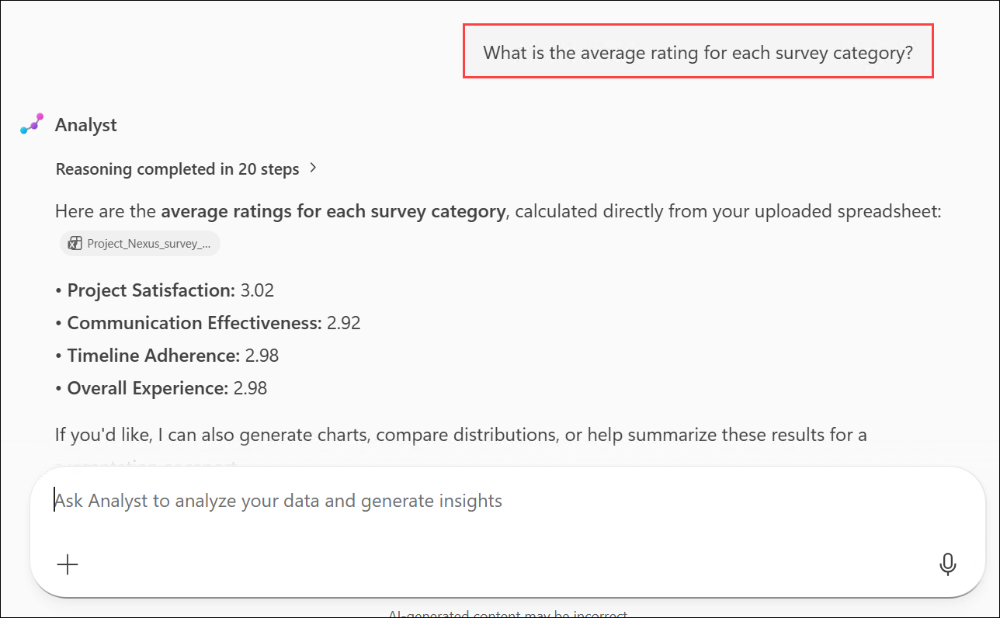

    > **Note:** If you encounter a blank screen, scroll upward to locate the response.

2. Review the results carefully.

3. At this stage, you may continue exploring the survey results using the **Analyst** agent. You can enter your own custom prompts or try the following prompts based on the type of analysis you want to perform.

    - **Quantitative analysis prompts:**

        - `Which category received the highest average rating, and which received the lowest?`

            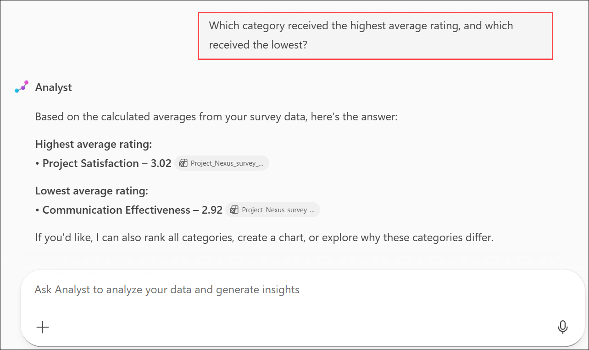

            > **Note:** The responses generated by Copilot agents may vary depending on the prompt interpretation and the available data. As a result, the output you receive may differ from the examples shown in the images.
    
        - `How many participants rated project satisfaction as 4 or higher?`
        
            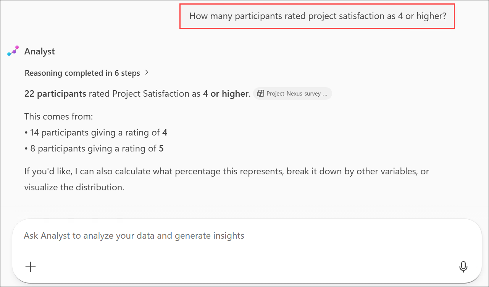
    
        - `What percentage of participants rated timeline adherence below 3?`
        
        - `Can you identify any correlations between communication effectiveness and overall experience?`

    - **Qualitative analysis prompts:**
        
        - `Summarize the most common themes in the comments section.`
        
            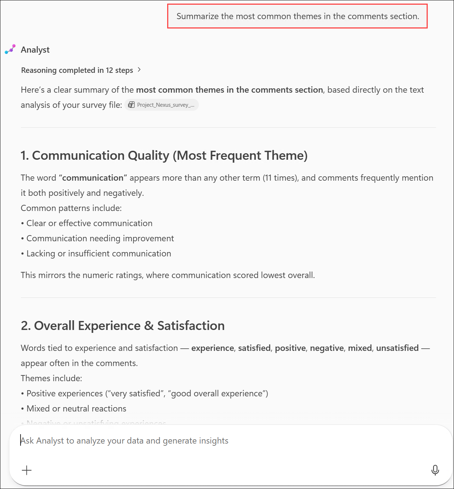

            > **Note:** The responses generated by Copilot agents may vary depending on the prompt interpretation and the available data. As a result, the output you receive may differ from the examples shown in the images.

        - `Are there any recurring concerns or suggestions mentioned in the comments?`
        
        - `Identify any comments that mention issues with communication or timeline.`
        
    - **Insight and recommendation prompts:**

        - `Based on the survey data, what are the top three strengths of Project Nexus?`        

            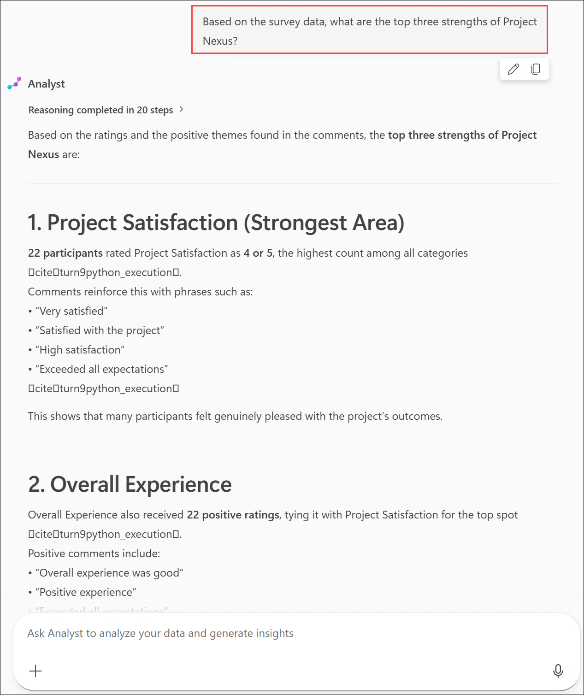
        
        - `What are the key areas for improvement suggested by the participants?`
        
        - `Provide a summary report of the survey findings with actionable recommendations.`

    - **Quantitative visualization prompts:**

        - `Generate a pie chart of overall ratings distribution.`
        
            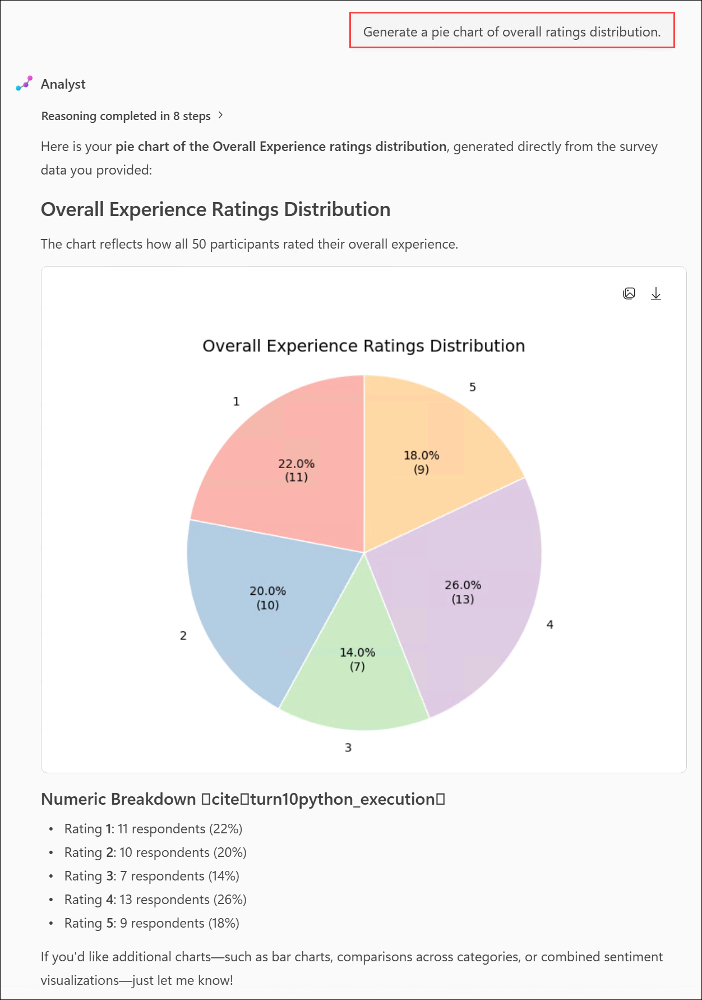

            > **Note:** The responses generated by Copilot agents may vary depending on the prompt interpretation and the available data. As a result, the output you receive may differ from the examples shown in the images.
        
        - `Create a bar chart comparing the average ratings for Project Satisfaction, Communication Effectiveness, Timeline Adherence, and Overall Experience.`
            
        - `Plot a histogram of the satisfaction ratings to see the distribution of ratings.`

        - `Generate a scatter plot to analyze the relationship between Communication Effectiveness and Overall Experience.`
        
            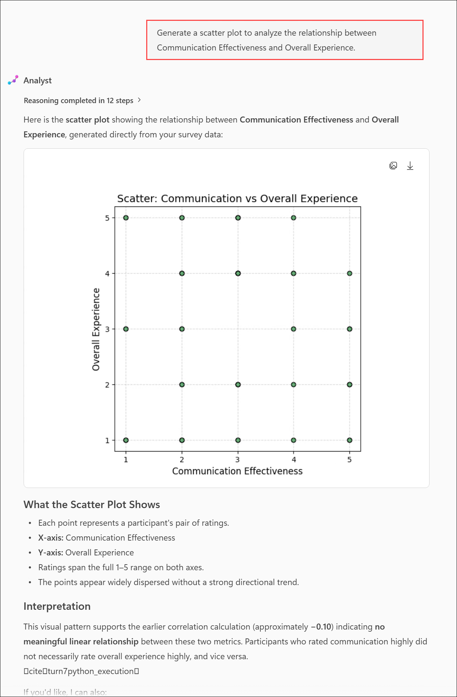

            > **Note:** The responses generated by Copilot agents may vary depending on the prompt interpretation and the available data. As a result, the output you receive may differ from the examples shown in the images.

        - `Create a correlation heatmap for all numeric rating categories.`
        
        - `Make a box plot for each rating category to show the range and quartiles.`

        - `Plot a line graph showing timeline adherence ratings over participants ordered by Participant ID.`

## Summary

In this exercise, you've used the Microsoft 365 Copilot Analyst agent to analyze the Project Nexus survey dataset. You uploaded the dataset, identified key trends, explored quantitative and qualitative insights, generated visualizations, and produced data-driven recommendations to better understand the outcomes of the Project Nexus initiative

### You have successfully completed the Exercise. Click on Next >> to proceed with next Exercise.


