# Exercise 2: Researcher Agent

### Estimated Duration: 20 Minutes

## Lab Overview

In collaborative initiatives like **Project Nexus**, important information is often spread across **Outlook emails, Teams chats, meetings, and shared documents**. Manually consolidating this information can be time-consuming and may result in missed insights.

The **Microsoft 365 Copilot Researcher agent** helps address this challenge by intelligently gathering and synthesizing relevant content from across your Microsoft 365 environment.

In this lab, you will upload the **Project Nexus** documents to **OneDrive** and use the **Researcher agent** to analyze communications and project data. Through natural language prompts, you will generate summaries, identify key decisions and action items, and gain insights that support project progress and decision-making.

## Lab Objectives

In this exercise, you will complete the following tasks:

- Task 1: Upload Project Nexus Documents to OneDrive

- Task 2: Use the Researcher Agent to Analyze Project Nexus Communications

## Task 1: Upload Project Nexus Documents to OneDrive

In this task, you'll upload the Project Nexus folder from the local system to OneDrive so that the Microsoft 365 Copilot Researcher agent can access the project documents during the analysis.

1. You are still on the **Microsoft 365** page. From the left navigation pane, select **Apps (1)**, and then choose **OneDrive (2)**.

    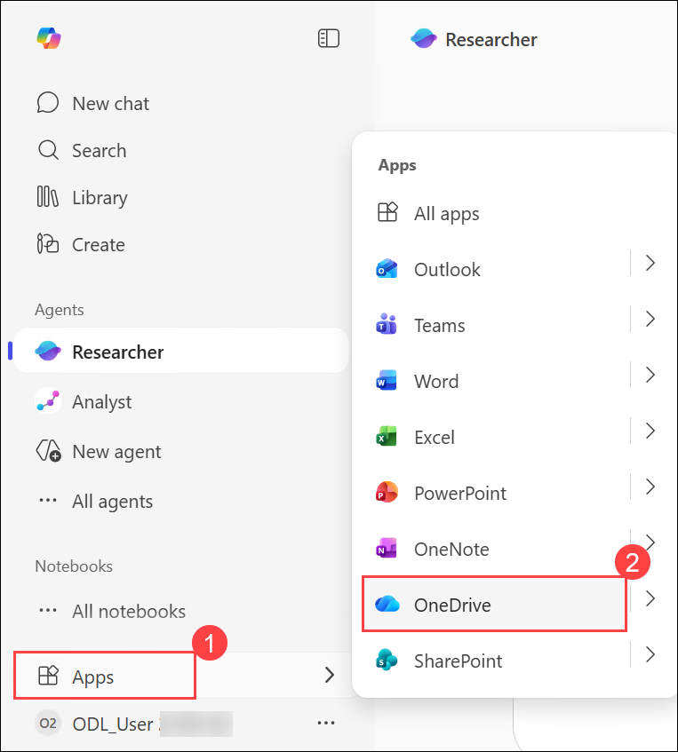

1. OneDrive will open up in a new tab in the browser.

1. On the **Work smarter with Copilot** pop-up window, click on **Not now**.

    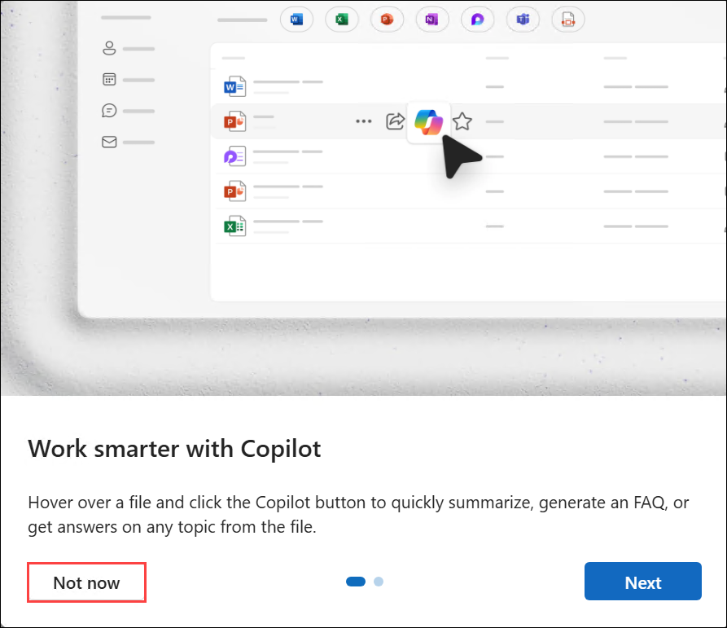

1. In **OneDrive**, select **+ Create or upload (1)** and then choose **Folder upload (2)** from the dropdown menu.

    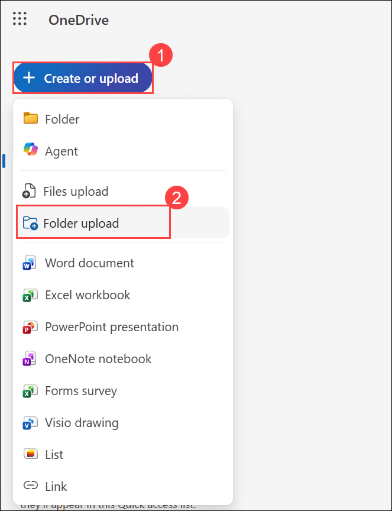

1. In the **Select folder to upload** window, navigate to **`C:\AllFiles` (1)**, select the **Project-Nexus (2)** folder, and then click **Upload (3)**.

    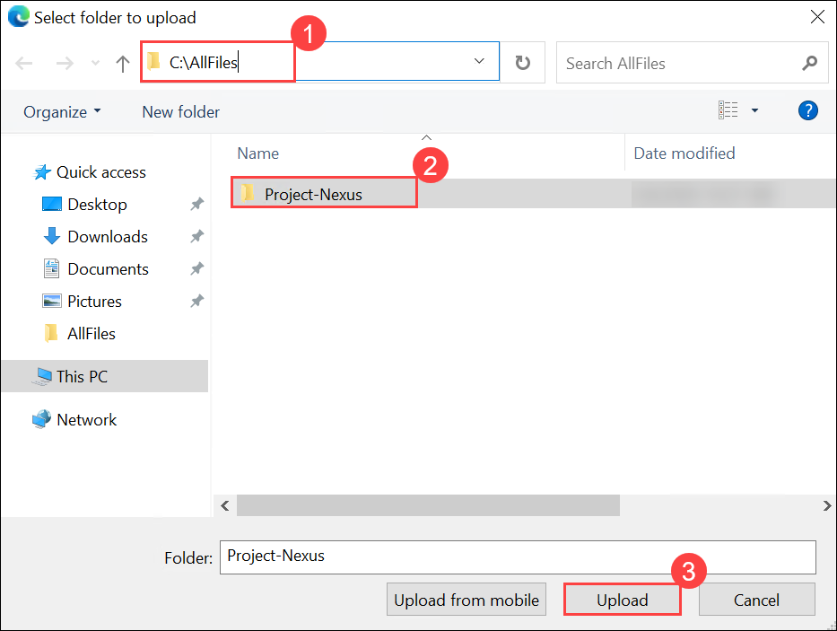

1. On the **Upload 6 files to this site?** dialog, click **Upload**.

    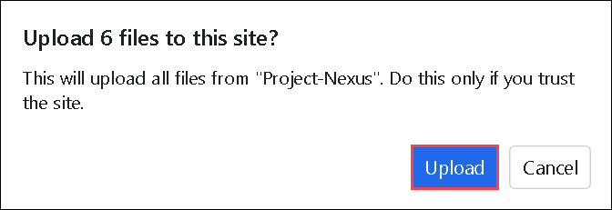

1. In **OneDrive**, select **My files (1)** from the left navigation pane and verify that the **Project-Nexus (2)** folder has been successfully uploaded.

    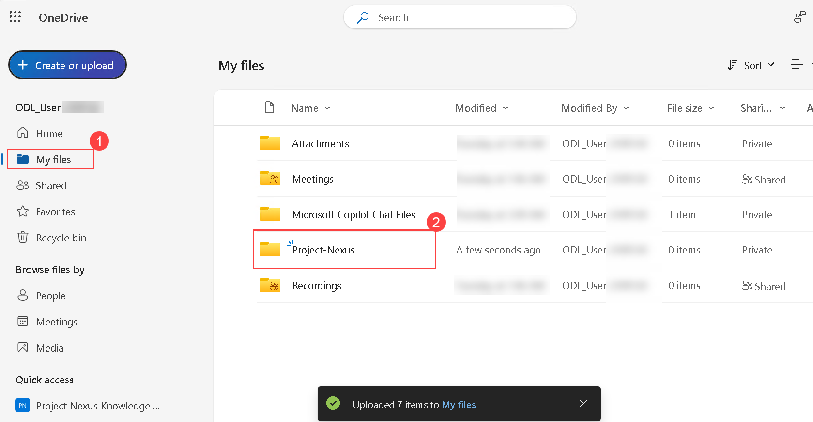

## Task 2: Use the Researcher Agent to Analyze Project Nexus Communications

In this task, you'll use the Microsoft 365 Copilot Researcher agent to gather and synthesize information related to Project Nexus from emails, meetings, Teams chats, and OneDrive documents. You will refine the analysis using follow-up prompts to identify key decisions, action items, and project insights.

1. Switch to the browser tab where **Microsoft 365** is open.

1. From the left navigation pane, under **Agents**, select the **Researcher** agent.

    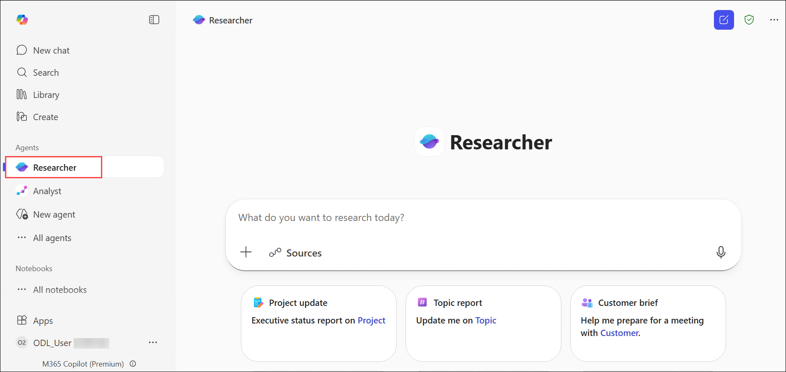

    >**Note:** If the **Researcher** agent isn't visible in the navigation pane, select **All agents**, and then in the **Agent Store**, choose **Researcher** under **Built by Microsoft**.

1. In the prompt field **(1)**, enter the following prompt and then click the **Send (2)** arrow to submit the request:

    ```
    Help me gather and summarize all recent discussions, documents, emails, and meetings related to Project Nexus from the past 90 days.
    ```

    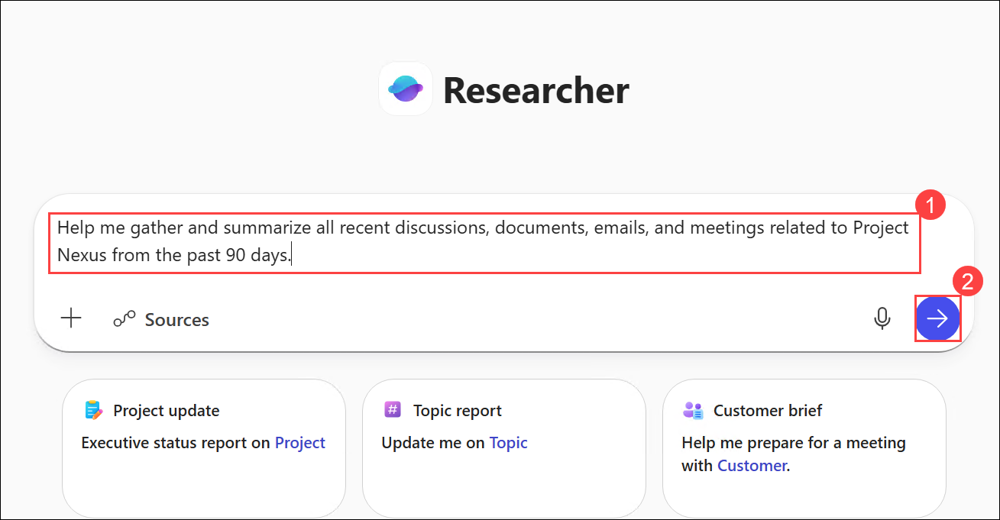

1. Review the **Researcher** agent’s response. If the agent asks follow-up questions to refine the summary, provide the requested details or respond according to your preference to continue the analysis.

    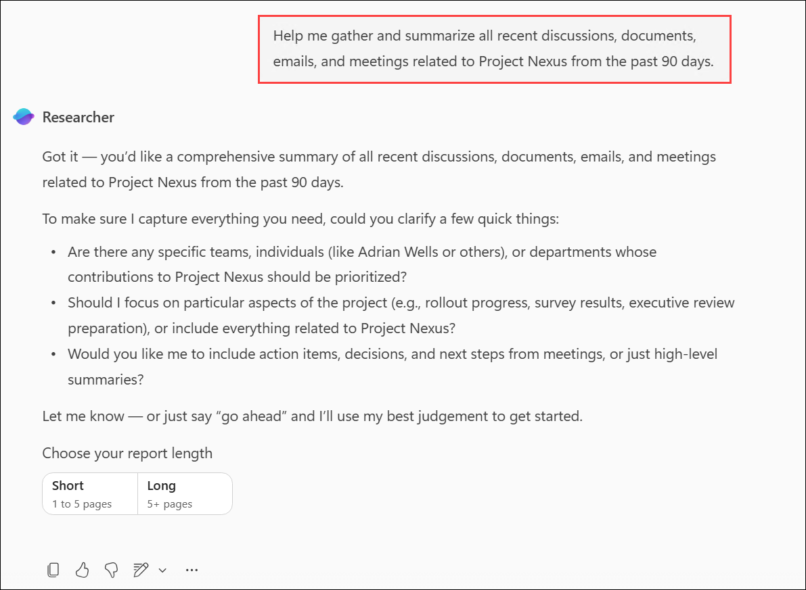

1. The Researcher agent will:

    * Search Outlook (Inbox and Sent Items)
    * Review Teams chats and channel messages
    * Scan meetings and calendar entries
    * Analyze OneDrive documents (including your uploaded Project Nexus folder)

1. After reviewing the response, you can refine the scope of the analysis by entering a follow-up prompt such as **`List any action items for me.`** 

1. After submitting the prompt, the Researcher agent begins analyzing the available information and generating a response. You can select the **Show more** icon to view the step-by-step reasoning and processing performed by the Researcher agent. If needed, select **Show less** to collapse and minimize the detailed view.

    .png)

    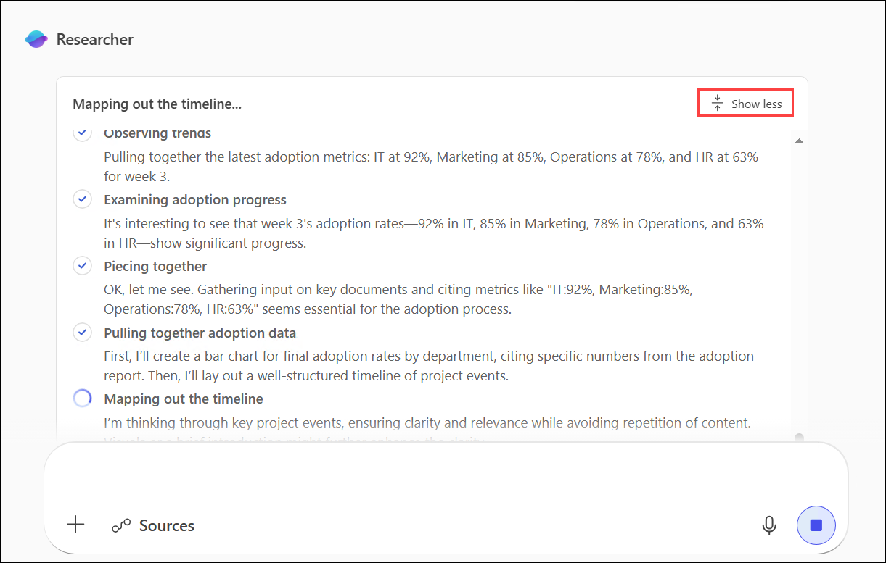

1. Review the updated response generated by the Researcher agent.

    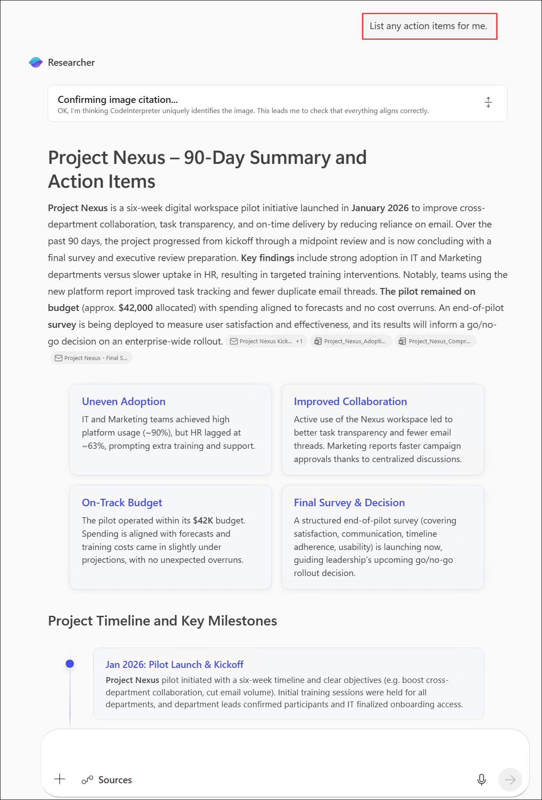

    >**Note:** The Researcher agent may take a few minutes to analyze the available content and generate a comprehensive response.

    > **Note:** The responses generated by Copilot agents may vary depending on the prompt interpretation and the available data. As a result, the output you receive may differ from the examples shown in the images.

1. You can also try the following prompts:

    - `Provide more details on the meeting with Adrian Wells.`

        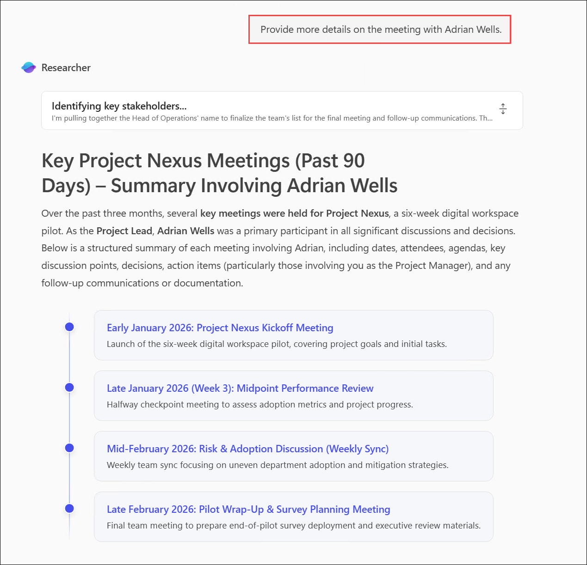

        >**Note:** The Researcher agent may take a few minutes to analyze the available content and generate a comprehensive response.

        > **Note:** The responses generated by Copilot agents may vary depending on the prompt interpretation and the available data. As a result, the output you receive may differ from the examples shown in the images.

    - `Draft an email to the team about the project participation.`
    
        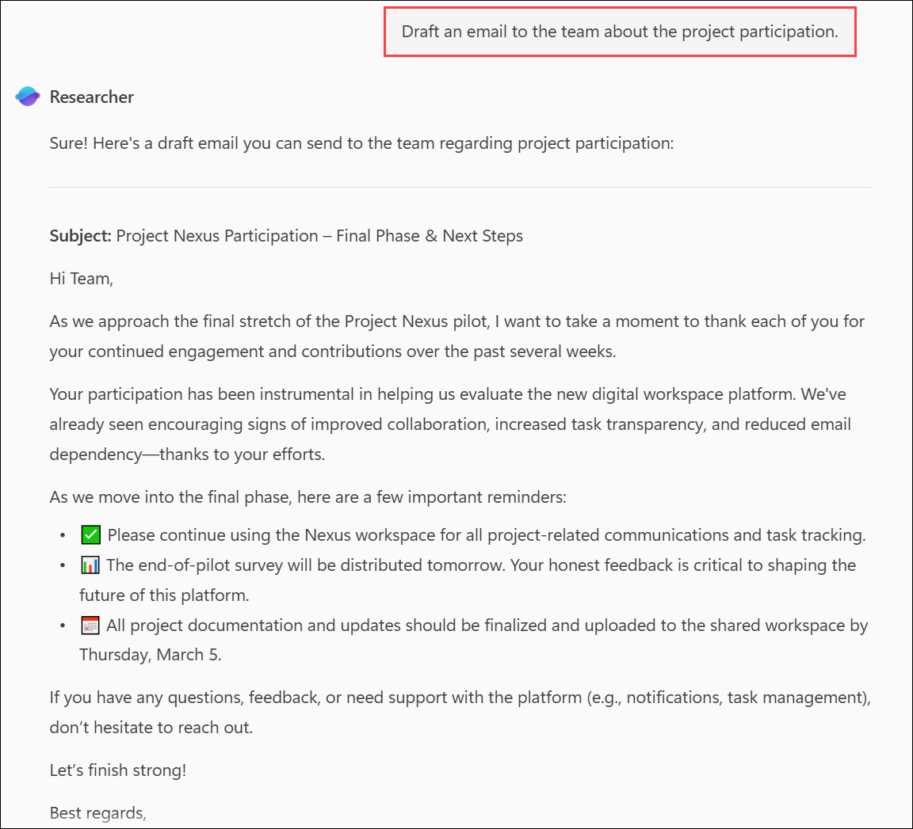
        
        >**Note:** The Researcher agent may take a few minutes to analyze the available content and generate a comprehensive response.

1. Feel free to submit additional requests to the **Researcher** agent to further explore its capabilities. You can try some of the prompts listed below or enter your own prompts to see the types of insights and responses the agent can provide.

    - **General research and information gathering:**

        - `Summarize the key decisions made during the Project Nexus pilot.`

        - `What decisions have been made about Project Nexus in the past month?`

            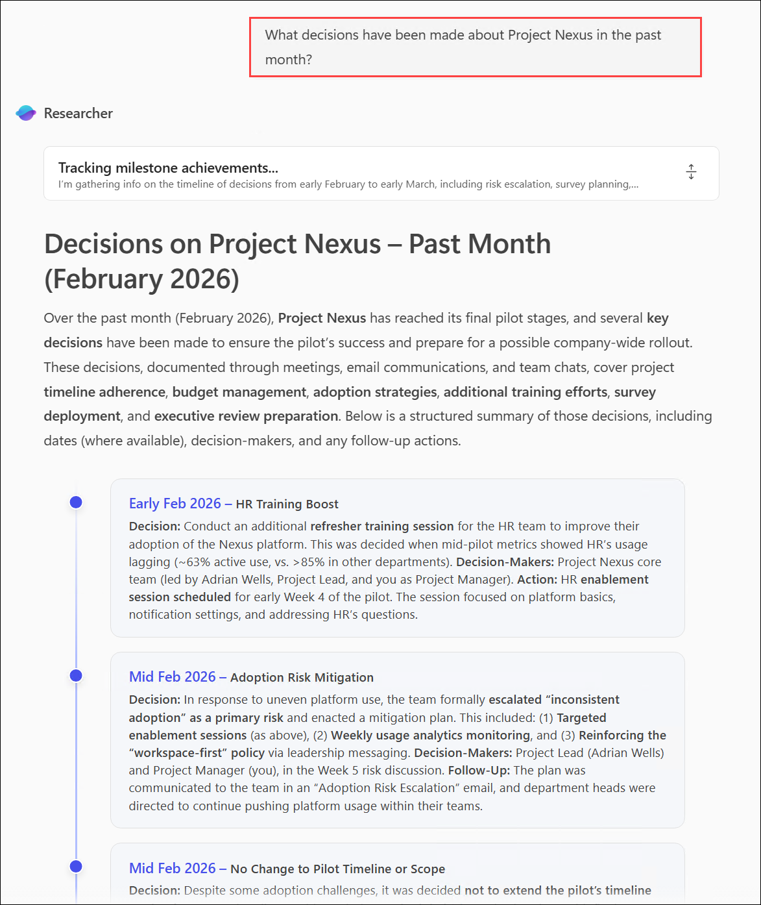

            >**Note:** The Researcher agent may take a few minutes to analyze the available content and generate a comprehensive response.

        - `Find and summarize feedback on our updated remote work policy.`

        - `List key deliverables and deadlines discussed in recent meetings about Project Nexus.`

        - `Who are the main contributors to the Project Nexus?`
    
    - **Meeting preparation:**

        - `Help me prepare for an upcoming meeting by summarizing recent communication and shared files about Project Nexus.`

        - `What topics have been discussed in past weekly team syncs?`

        - `What follow-up actions did I miss from last Thursday's leadership meeting?`

    - **Progress and status updates:**
        
        - `Summarize the current status and blockers for Project Nexus.`

        - `What progress has been made on Project Nexus based on email and Teams updates?`

        - `Generate a one-page update on Project Nexus for next week's check-in.`

    - **Unanswered questions and gaps:**

        - `What open questions remain about Project Nexus?`

        - `Which action items from the last review meeting are still incomplete?`

            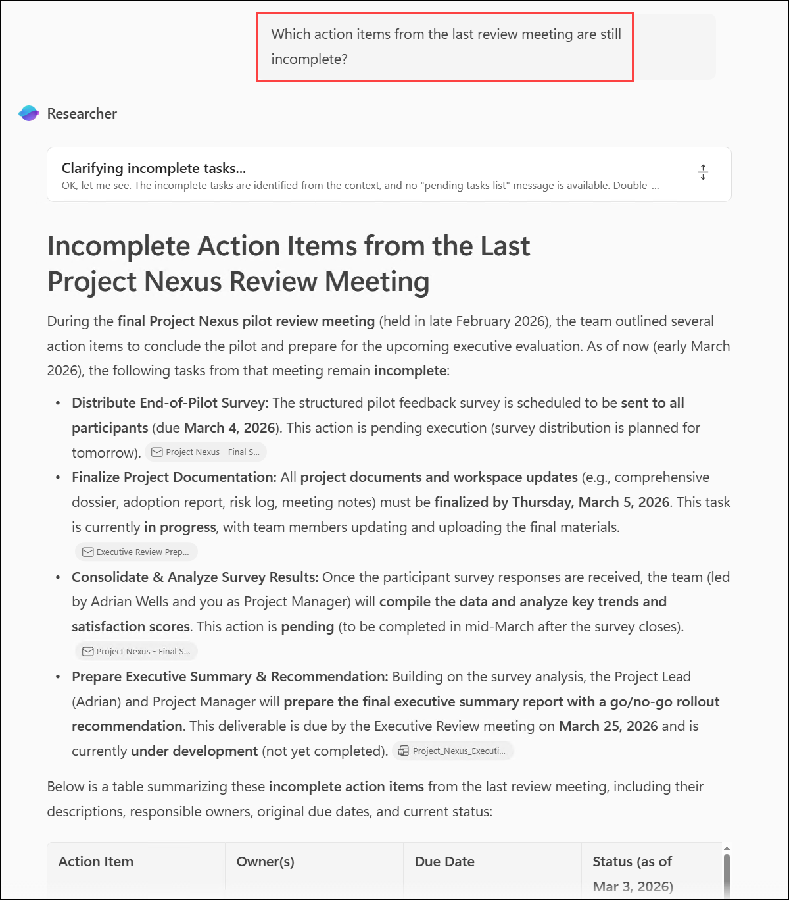

    - **Document discovery and insights:**
        
        - `Find the latest version of the Project Nexus and summarize key updates.`

        - `List and link to all budget files created in the last 60 days for Project Nexus.`

            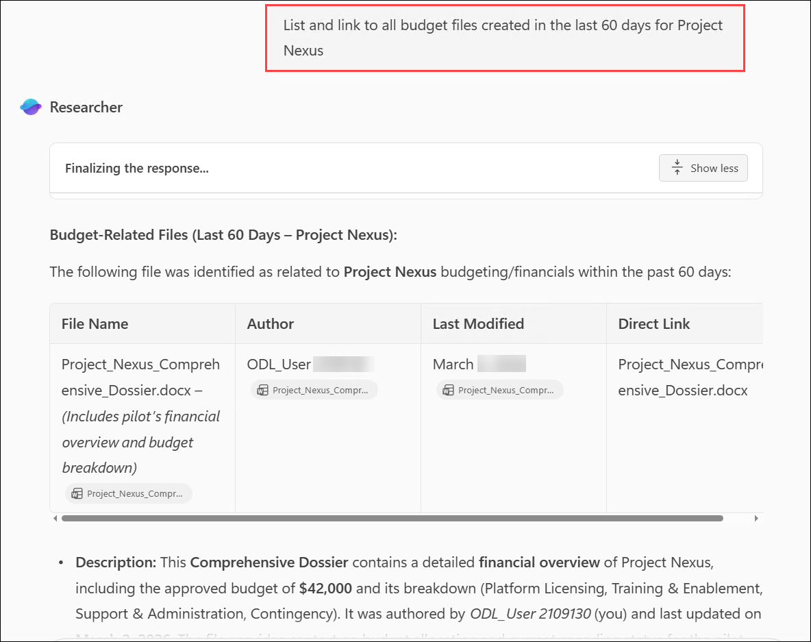

            >**Note:** The Researcher agent may take a few minutes to analyze the available content and generate a comprehensive response.

            > **Note:** The responses generated by Copilot agents may vary depending on the prompt interpretation and the available data. As a result, the output you receive may differ from the examples shown in the images.

        - `Summarize contents of shared documents related to Project Nexus.`

## Summary

In this exercise, you've uploaded the **Project Nexus** project files to OneDrive and used the Microsoft 365 Copilot **Researcher** agent to analyze communications and documents related to the project. You explored how the agent consolidates information from Outlook, Teams, meetings, and shared files to generate summaries, extract action items, and provide insights that support project decision-making.

### You have successfully completed the Exercise. Click on Next >> to proceed with next Exercise.

