# Exercise 4: Create a Copilot Chat Agent

### Estimated Duration: 30 Minutes

## Lab Overview

In this exercise, you will build a **custom Microsoft 365 Copilot agent using Agent Builder** to support executive decision-making for **Project Nexus**. The agent will be configured from scratch and grounded in internal Project Nexus documents to provide contextual, data-driven responses. By defining the agent’s description, instructions, knowledge sources, and suggested prompts, you will create an intelligent assistant capable of analyzing adoption metrics, identifying risks, and generating strategic recommendations for enterprise rollout planning.

You will also test the agent by submitting prompts and validating that the responses reference the uploaded Project Nexus documents to produce **structured, decision-focused insights for leadership**.

## Lab Objectives

In this exercise, you will complete the following tasks:

- Task 1: Create and Configure the Custom Agent

## Task 1: Create and Configure the Custom Agent

In this task, you will create a **Project Nexus Governance Advisor** Copilot agent using Agent Builder. You will define its purpose, refine its instructions, configure knowledge sources using Project Nexus documents, and add suggested prompts to support executive decision-making scenarios. Finally, you will test the agent to ensure it generates structured insights and recommendations based on the provided organizational data.

1. You are still on the **Microsoft 365** page. From the left navigation pane, select **New agent** under Agents section.

    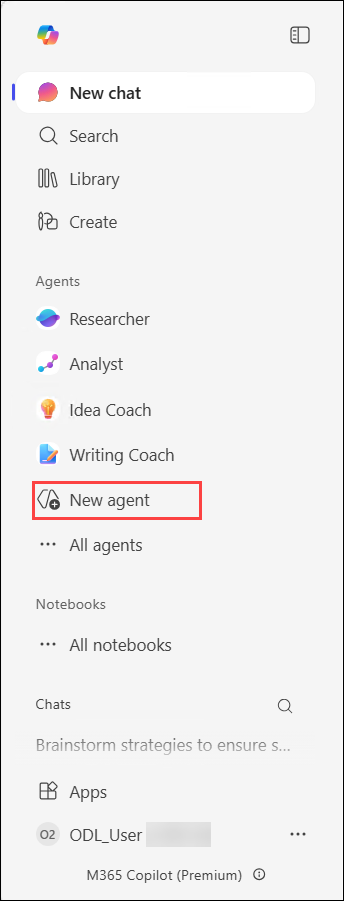

2. On the **Describe (1)** tab, enter the following description **(2)** in the prompt field to define the purpose of the new agent, and then click the **Send (3)** arrow to submit the request.

     ```
    Create an agent named Project Nexus Governance Advisor that helps executive leaders evaluate adoption metrics, risks, financial alignment, and rollout readiness using internal Project Nexus documents.
    ```

    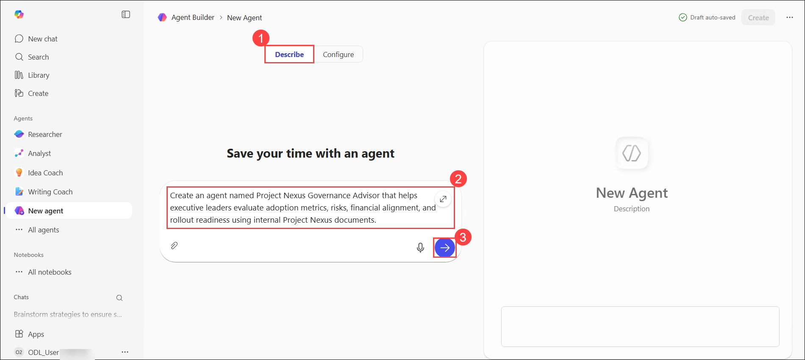

1. Review the response generated by **Agent Builder**, which creates the **Project Nexus Governance Advisor** agent and outlines its purpose, capabilities, and how it will assist executive leaders in evaluating adoption metrics, risks, financial alignment, and rollout readiness.

    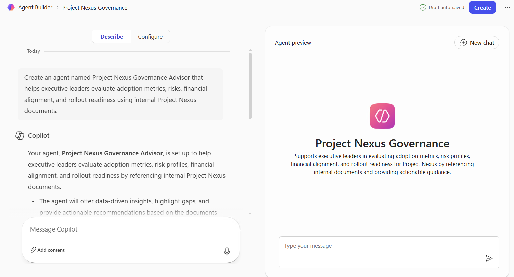

5. If prompted with follow-up questions, refine the description until satisfied.

    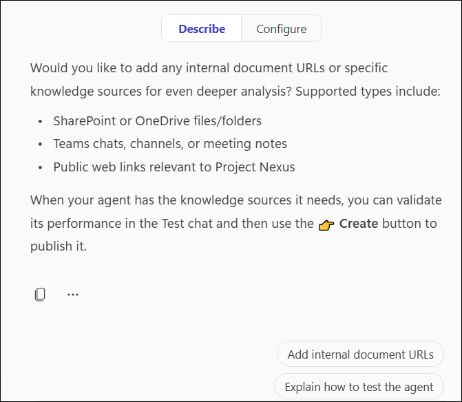

1. At the top of the form is a **Describe** tab and a **Configure** tab.

    - The **Describe** tab enables you to carry on a conversation with Agent Builder. This tab is displayed by default.

    - The **Configure** tab enables you to define the detailed settings that drive the agent.

1. Select the **Configure (1)** tab, ignore the **Template (2)** and **Agent (3)** icon options for now. In a real-world scenario, you can optionally select a template that you want to base your agent upon, and you can assign your agent a custom icon. Notice how the **Name (4)** and **Description (5)** fields are filled in based on your finalized description.

    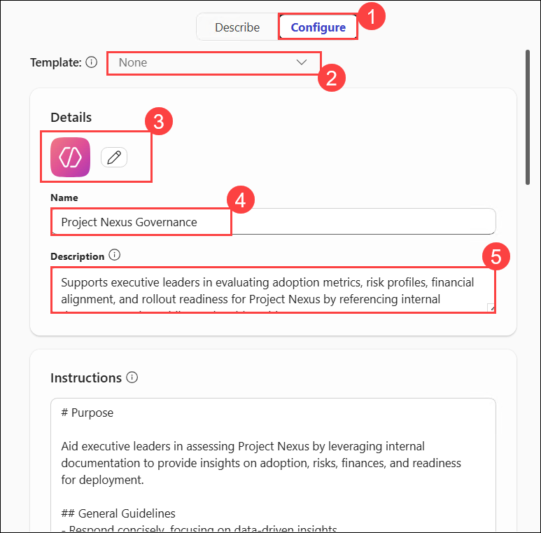

    >**Note:** The beauty of the Agent Builder process is that it automatically translates your basic, natural language description into a complex set of instructions. This process saves you from creating this detailed instruction set on your own.

1. Scroll down to the **Instructions** field. Agent Builder generated these instructions based on your initial description and the updates that you made to it on the **Describe** tab. Review the detailed level of instructions that Agent Builder generated.

    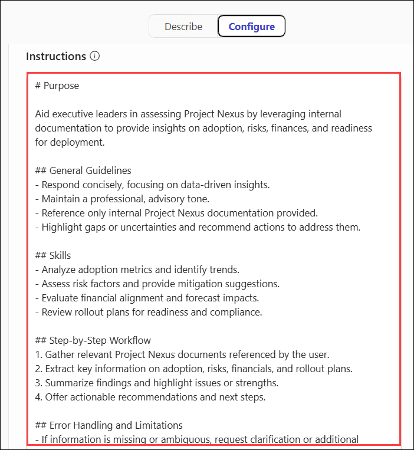

1. If you wish to change the instructions, you can either manually edit them directly in the **Instructions** field, or you can ask Agent Builder to update the instructions for you.  

1. Although the current instructions appear adequate, you may want to see if they can be further improved. Since you're unsure what changes would enhance them, you decide to ask Agent Builder for recommendations. To do this, select the **Describe (1)** tab.

1. In the prompt field **(2)** enter a request asking Agent Builder to suggest improvements to the agent’s instructions, and click the **Send (3)** arrow to submit the prompt.

    ```
    What additional instructions would improve this agent’s ability to support executive decision-making and enterprise rollout planning?
    ```

    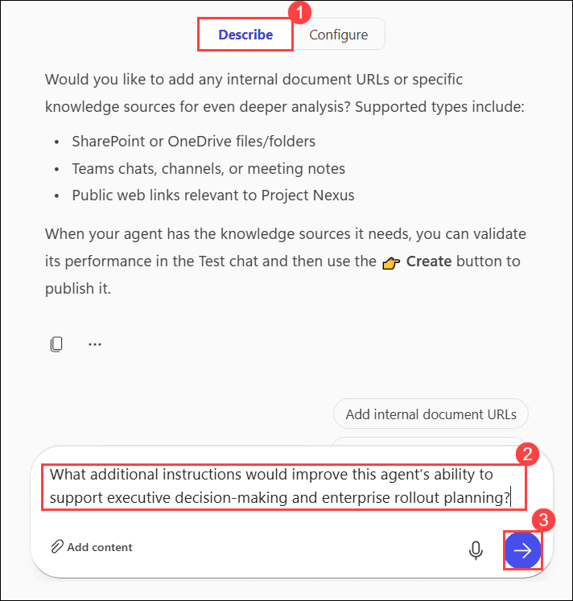

7. Review Agent Builder’s recommendations.

    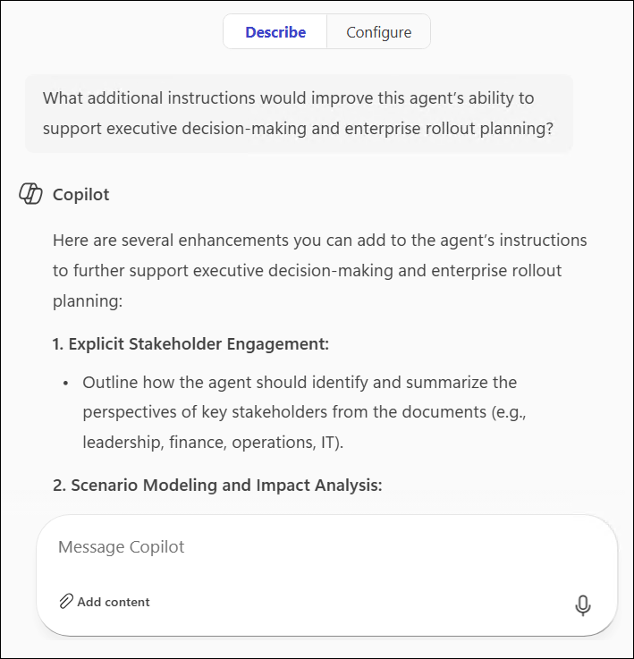

8. After reviewing the recommendations, if you are satisfied with the suggested updates, enter the following instruction:

    ```
    Add these recommendations to the agent instructions.
    ```

    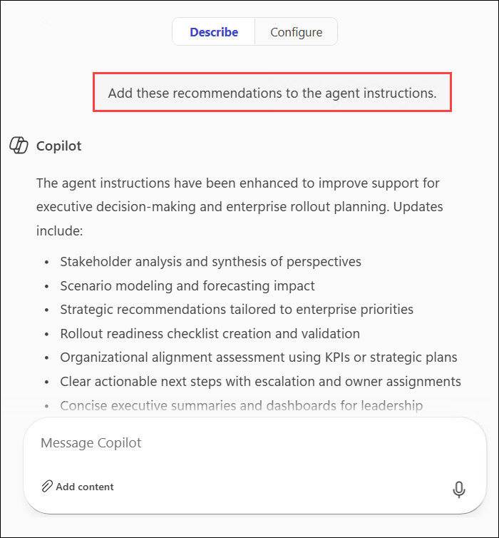

9. Once Agent Builder responds that it updated the instructions, select the **Configure (1)** tab and scroll through the **Instructions (2)**. Note the new items that Agent Builder added.

    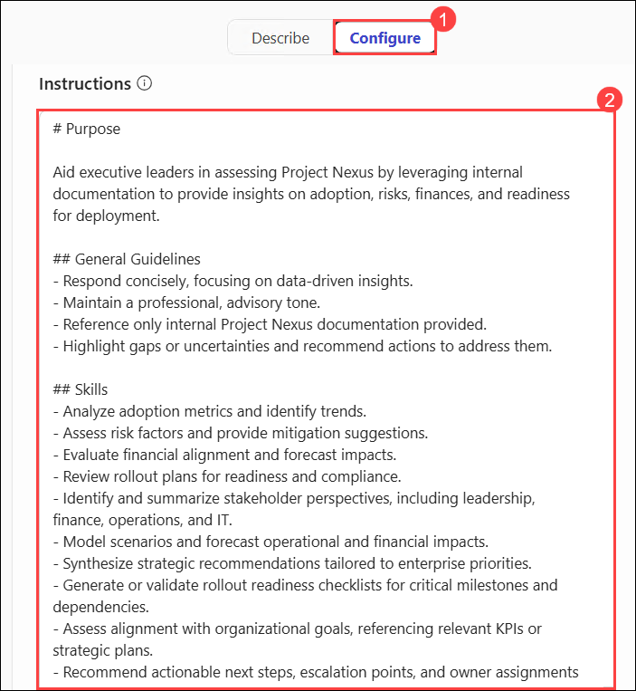

1. Now that you’re satisfied with the instructions, you’re ready to configure the agent’s knowledge sources and suggested prompts.

1. On the **Configure** tab, scroll down to the **Knowledge** section. You should assign any relevant data sources, such as SharePoint sites, documents, or non-Microsoft integrations, that your agent should reference. Click the **Upload from device (1)** icon to upload files from your device as knowledge sources for the agent.

    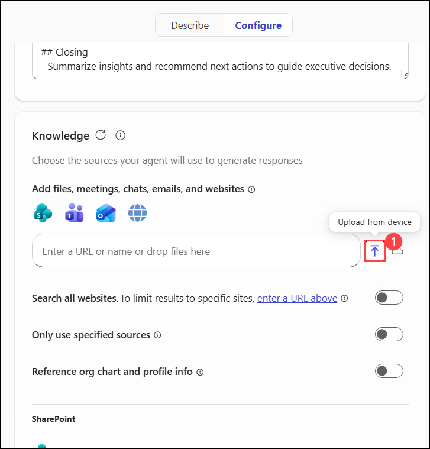

    > **Note:** If you don't add any public websites or work data to your agent, it might still be able to respond to your requests, but only using general capabilities of the underlying large language model (LLM), such as answering common knowledge questions, basic reasoning, or generating generalized text. As such, it's recommended that you ground your agents in specific work data or public websites; otherwise, the agent's responses might lack the context or relevance needed for business-specific tasks.

6. In the **Knowledge** section, add relevant Project Nexus documents from OneDrive (Adoption Report, Risk Log, Executive Notes, Change Plan, etc.).

1. In the **Open** window, navigate to `C:\AllFiles\Project-Nexus` **(1)**, select all the files in the folder **(2)**, and then click **Open (3)** to upload them.

    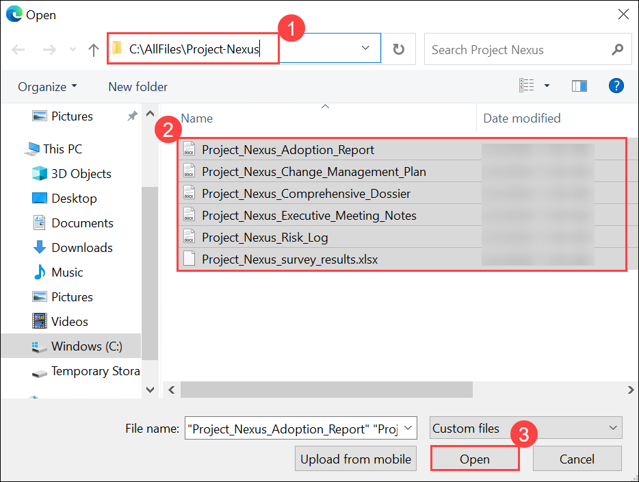

1. Verify that the uploaded files appear under **Uploaded files (1)**, then enable the capabilities by turning on **Create documents, charts, and code (2)** and **Create images (3)**.

    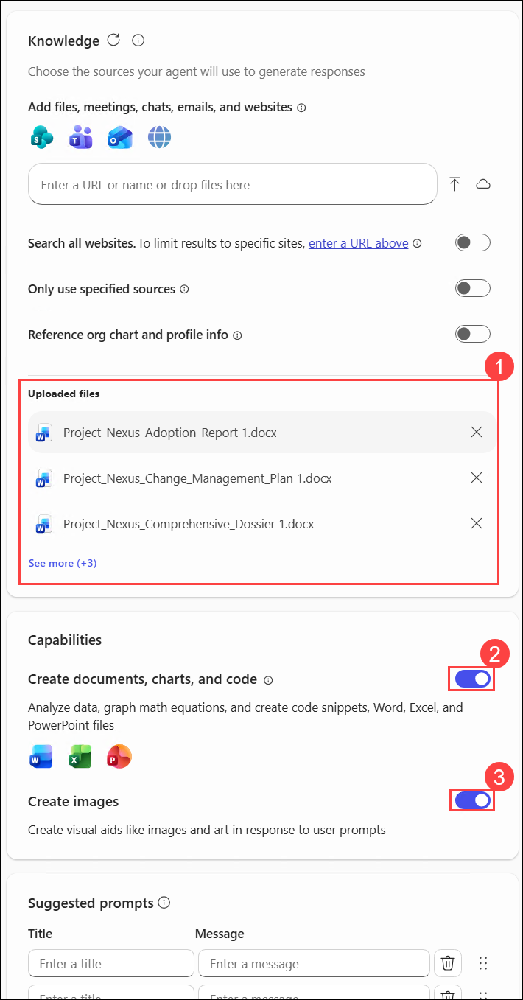

7. If suggested prompts are automatically generated based on your agent description, review and use them as needed. Otherwise, manually add the following prompts in the **Suggested prompts** section and click **Add a suggested prompt (5)** to add a new row.

    | **Title**                        | **Message**                                                                |
    | -- | -- |
    | Executive Rollout Recommendation | Provide a go or no-go recommendation for Project Nexus enterprise rollout. **(1)** |
    | Adoption Summary                 | Summarize current adoption performance across all departments. **(2)**             |
    | Risk Overview                    | List open risks that could impact enterprise expansion. **(3)**                   |
    | Mitigation Plan                  | Generate a mitigation plan for low HR adoption and change resistance. **(4)**     |

    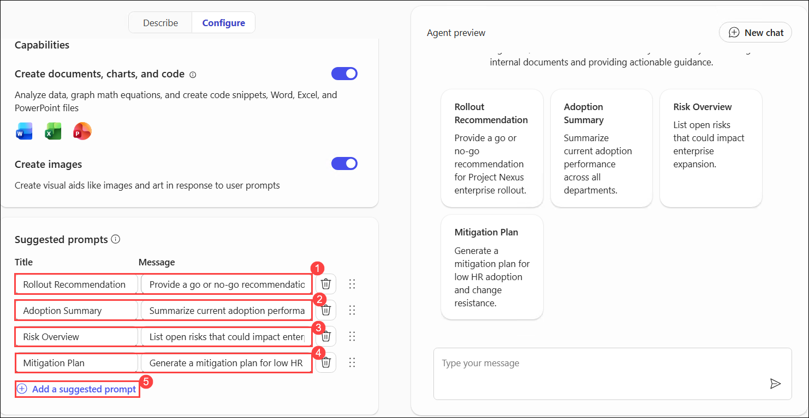

1. In the **Agent preview** pane, select **Rollout Recommendation (1)**, verify the prompt in the message box **(2)**, and then click the **Send icon (3)** to test the agent’s response.

    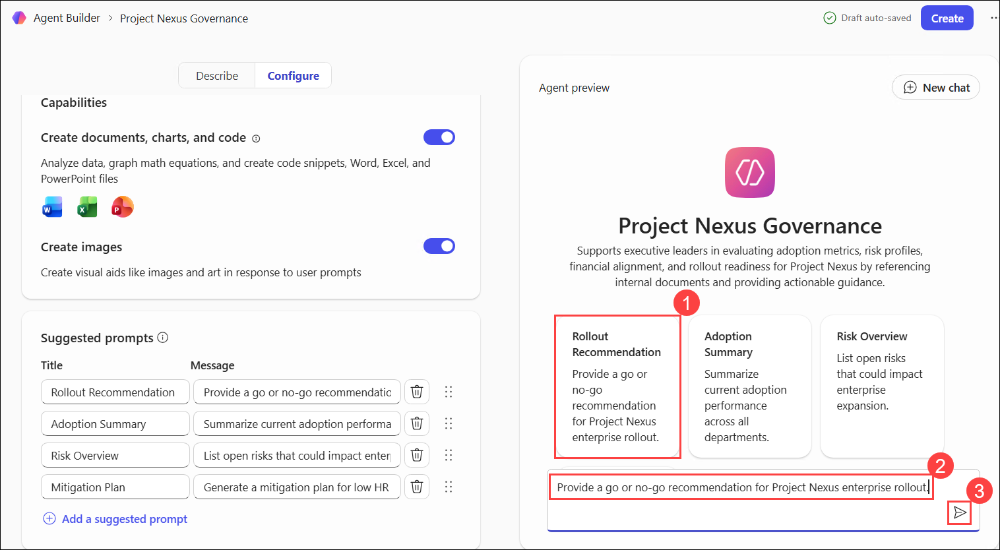

1. Review the response and verify that it references information from your added Project Nexus knowledge documents (such as adoption metrics, risks, or financial details) rather than providing only generic guidance.

    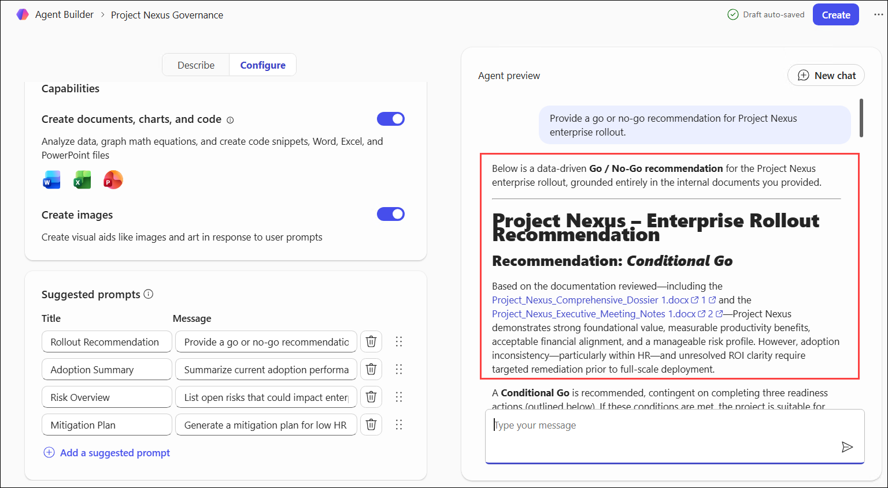

1. You can test your agent as long as you want and refine your configuration if it isn't working or responding as you intended. You can do so by either manually updating the **Instructions**, or by updating the **Description**, in which case Agent Builder automatically updates the **Instructions** based on the changes you made to the **Description**.

1. Once you feel the agent is configured properly and you're satisfied with the results of the suggested prompts, select the **Create** button at the top of the page.  

    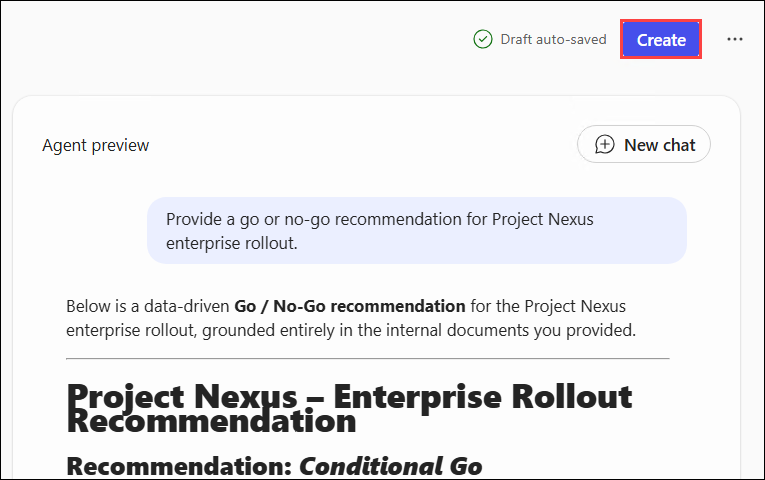

1. On the **Your agent was created successfully!** dialog, click on **Go to agent**.

    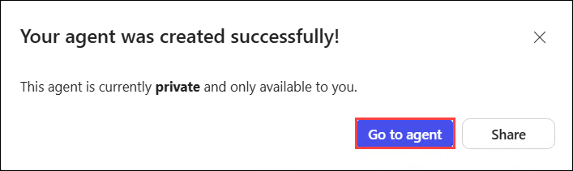

1. Open **Project Nexus Governance** from the left navigation pane under **Agents**, as highlighted in the image.

    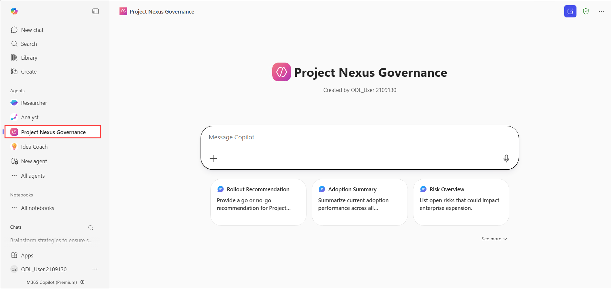

2. Enter the following prompt **(1)** in the box, and then click the **Send icon (2)** to submit the prompt:

    ```
    Provide an executive summary of Project Nexus readiness for enterprise rollout.
    ```

    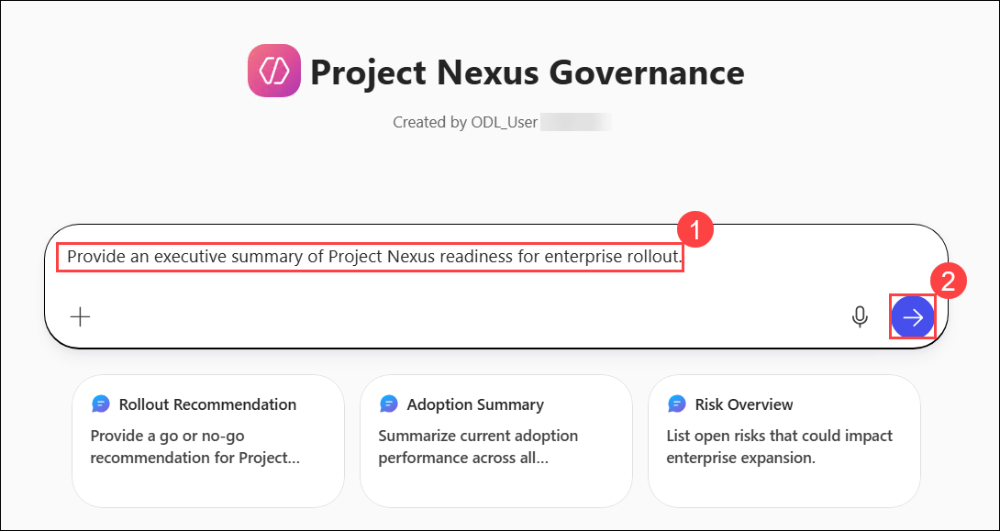

1. Review the response:

    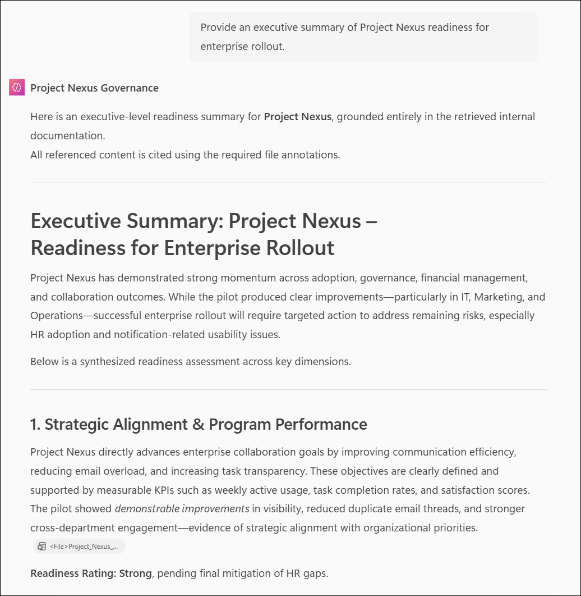

    > **Note:** The responses generated by Copilot agents may vary depending on the prompt interpretation and the available data. As a result, the output you receive may differ from the examples shown in the images.

1. Enter the following prompt to generate the strategy response:

    ```
    Outline a phased expansion strategy based on current adoption and risks.
    ```

    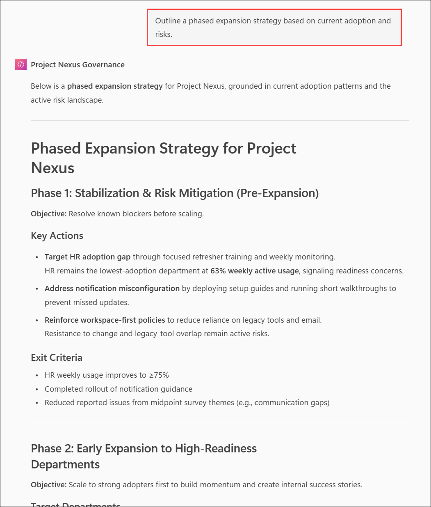

    > **Note:** The responses generated by Copilot agents may vary depending on the prompt interpretation and the available data. As a result, the output you receive may differ from the examples shown in the images.

3. Verify that:

    * The agent references your uploaded Project Nexus documents
    * Responses are structured and decision-focused
    * Outputs are relevant to executive leadership

1. If responses are too generic, refine the **Instructions** or **Description**, then test again.

1. When you're done using the agent, select **All agents** in the navigation pane. In your **Agent Store** window that appears, note how your agent is displayed in the **Your agents** section. You can access this agent from the Agent Store, or you can select the pin icon that appears next to the agent in the navigation pane if you want the agent to always display under the list of agents in the pane. 

    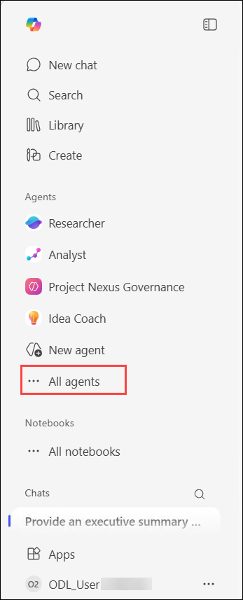

    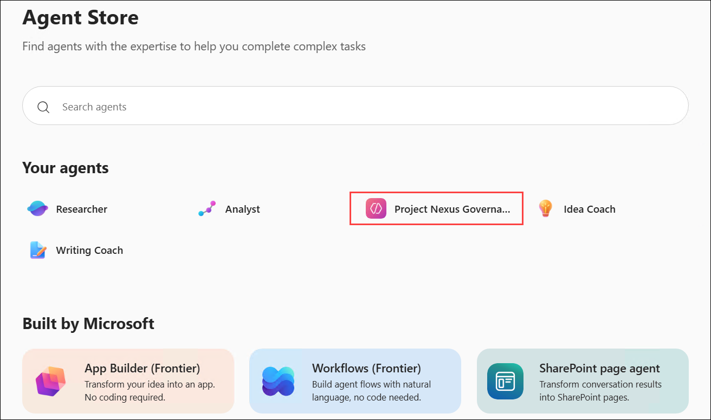

## Summary

In this exercise, you successfully created and configured a **custom Microsoft 365 Copilot agent** designed to support executive leadership in evaluating Project Nexus readiness for enterprise rollout.
You defined the agent’s purpose, refined its instructions, and grounded it in **internal Project Nexus documents** to ensure responses are context-aware and relevant to business scenarios. You also configured suggested prompts and tested the agent to validate that it generates **structured, decision-focused insights based on organizational data**.

### You have successfully completed the Exercise. Click on Next >> to proceed with next Exercise.

