# Exercise 5: Create a SharePoint Agent

### Estimated Duration: 30 Minutes

## Lab Overview

As organizations increasingly rely on SharePoint to manage knowledge, project documentation, and team resources, the ability to create intelligent agents that interact with this content becomes a powerful productivity capability. Microsoft 365 Copilot enables users to create SharePoint-connected agents that can surface information, answer questions, and assist users in navigating site content more efficiently.

In this exercise, you will create a SharePoint site that serves as a knowledge hub for **Project Nexus** documentation. You will then create a **SharePoint Copilot agent** that is connected to this site and capable of answering questions based on its content. By grounding the agent in SharePoint documents, you enable it to provide contextual insights, summarize information, and help users quickly locate relevant resources stored within the site.

## Lab Objectives

In this lab, you will complete the following tasks:

- Task 1: Create a SharePoint Communication site

- Task 2: Create a SharePoint-Connected Copilot agent

- Task 3: Test the SharePoint Copilot Agent

## Task 1: Create a SharePoint Communication Site

In this task, you will create a **SharePoint Communication site** that will act as a knowledge hub for Project Nexus documentation. You will also upload several Project Nexus documents to the site’s **Documents library**, which will later serve as the knowledge source for the Copilot agent.

1. Navigate to the **Microsoft 365** home page.

2. From the navigation pane, select **Apps (1)**, and then select **SharePoint (2)**.

    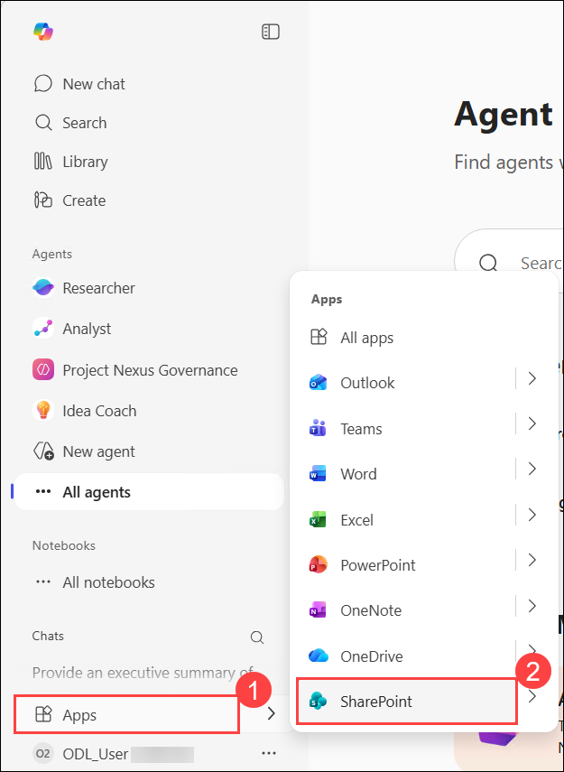

3. On the SharePoint home page, select **+ Create site**.

    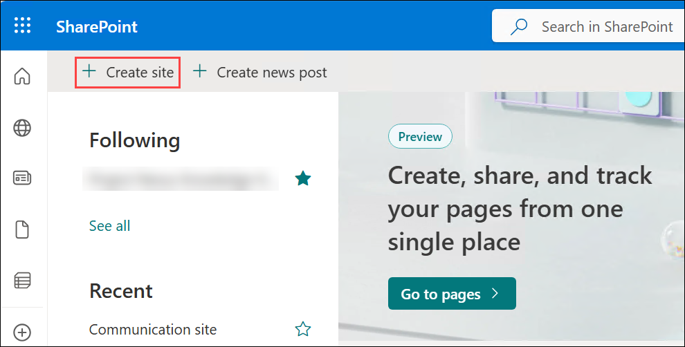

4. In the **Create a site: Select the site type** window, select **Communication site**.

   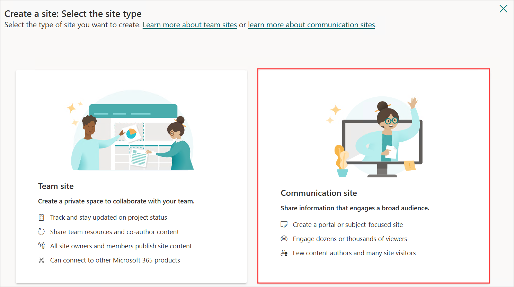

1. In the **Select a template** window, under **From Microsoft (1)** tab, select **Standard communication (2)**.

    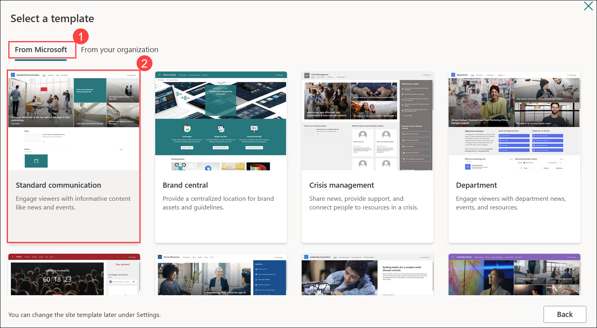

1. In the **Preview and use 'Standard communication' template** window, click on **Use template**.

    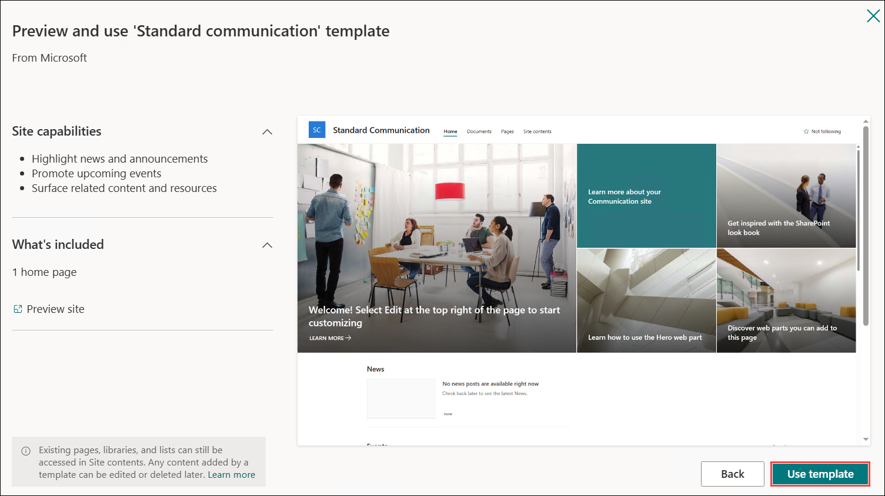

5. On the **Give your site a name** page, provide the following details and then click **Next (3)**:

   - **Site name:** Project Nexus Knowledge Center <inject key="DeploymentID"></inject> **(1)**
   - **Site description:** `SharePoint site containing Project Nexus documents used to power a Copilot agent.` **(2)**

        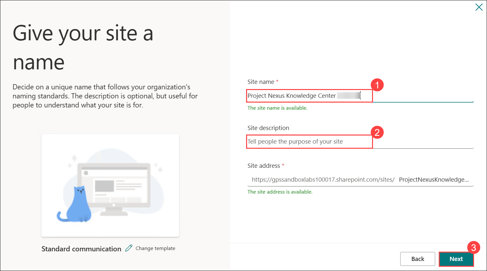

1. On the **Set language and other options** page, choose **English (1)** as the language and then click **Create site (2)**.

    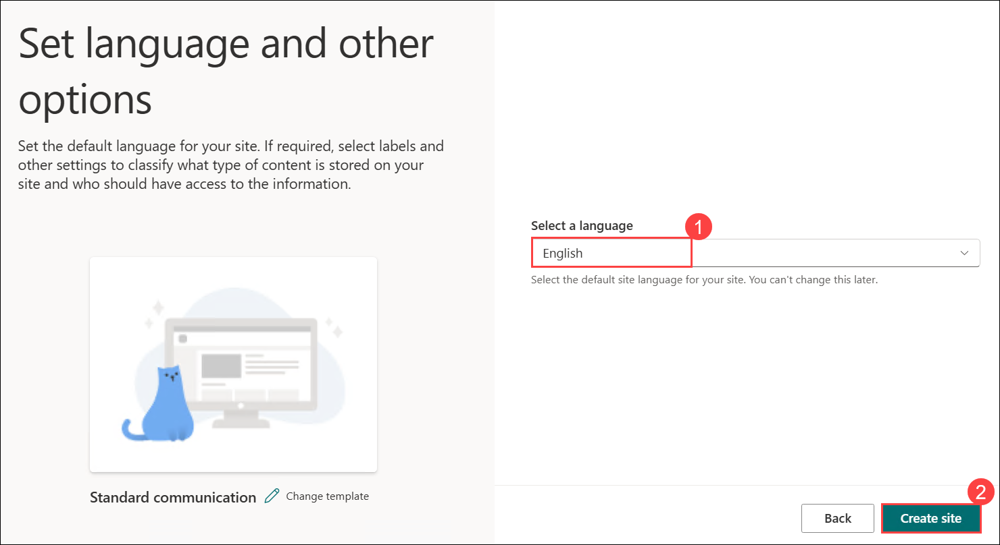

7. Once the site is created, you are redirected to the site's home page. From the top navigation bar, select the **Documents** tab.

    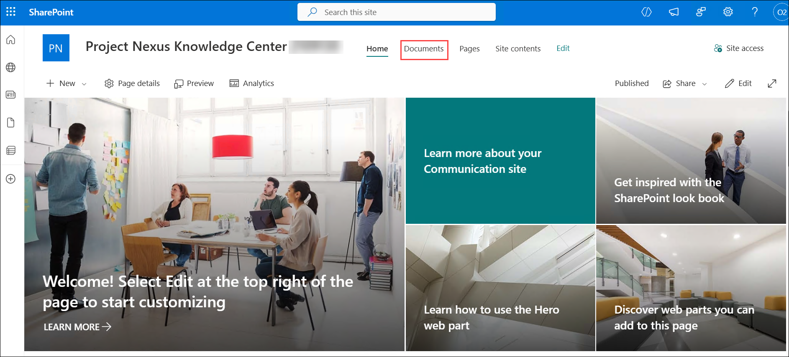

1. Click **+ Create or upload (1)**, and then select **Files upload (2)** to upload files to the Documents library.

    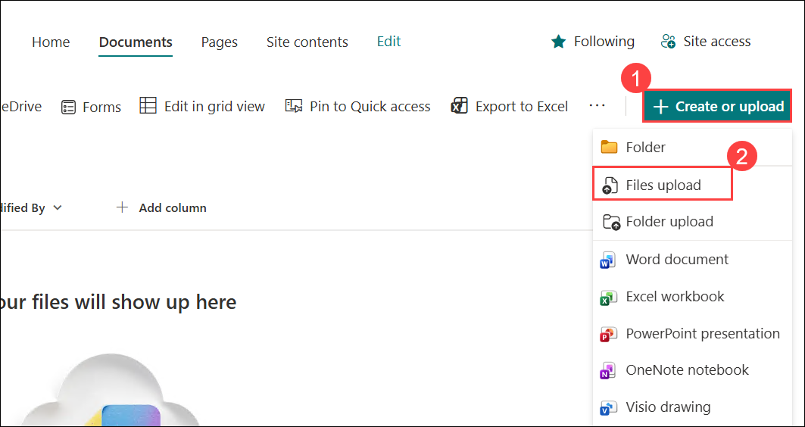

1. In the **Open** window, navigate to **C:\AllFiles\Project-Nexus (1)**, select all the files in the folder **(2)**, and then click **Open (3)** to upload them.

    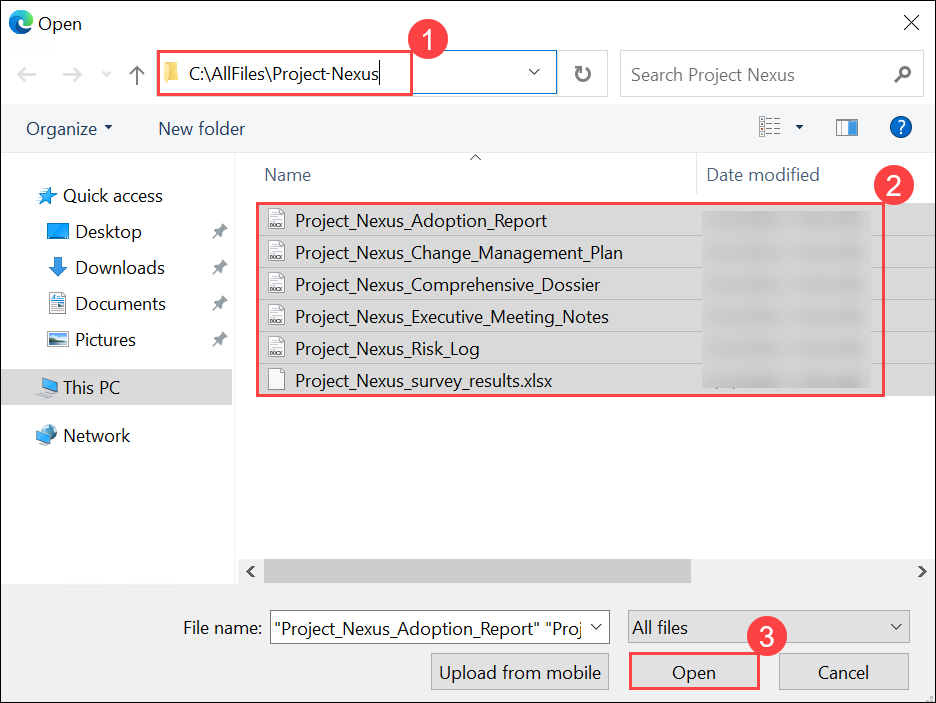

1. Verify that all the Project Nexus files are successfully uploaded and appear in the **Documents** library of the site you created.

    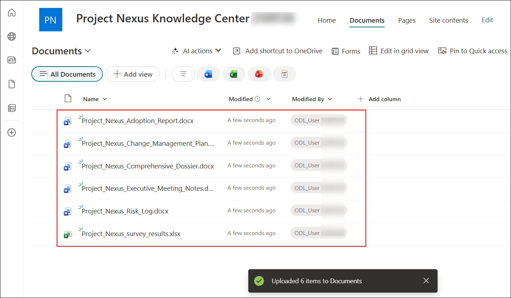

1. These documents will now serve as the knowledge source for your SharePoint Copilot agent.

## Task 2: Create a SharePoint-Connected Copilot Agent

In this task, you will create a **SharePoint Copilot agent** directly from the SharePoint document library. You will configure the agent’s name, purpose, knowledge sources, welcome message, starter prompts, and instructions so that the agent can answer questions based on the documents stored in the site.

1. On the **Documents** tab, click **AI actions (1)**, and then select **Create an agent (2)**.

    .png)

1. The Create your new agent form has three tabs - **Overview**, **Sources**, and **Behavior**. The Overview tab is opened first by default. From this tab, you must enter the agent's name and purpose. Default values are provided for each field, but you can change them now if you wish.

2. On the **Overview (1)** tab of the **Create your new agent** window, enter **Project Nexus SharePoint Assistant <inject key="DeploymentID"></inject> (2)** in the **Name** field. You can optionally select **Change (3)** to modify the agent icon if desired. An agent icon must be a .png file that does not exceed **1 MB** in size. For this exercise, leave the default icon unchanged. In the **Purpose** field, enter **`Help users find information, summarize documents, and answer questions related to Project Nexus resources stored in this SharePoint site` (4)**.

    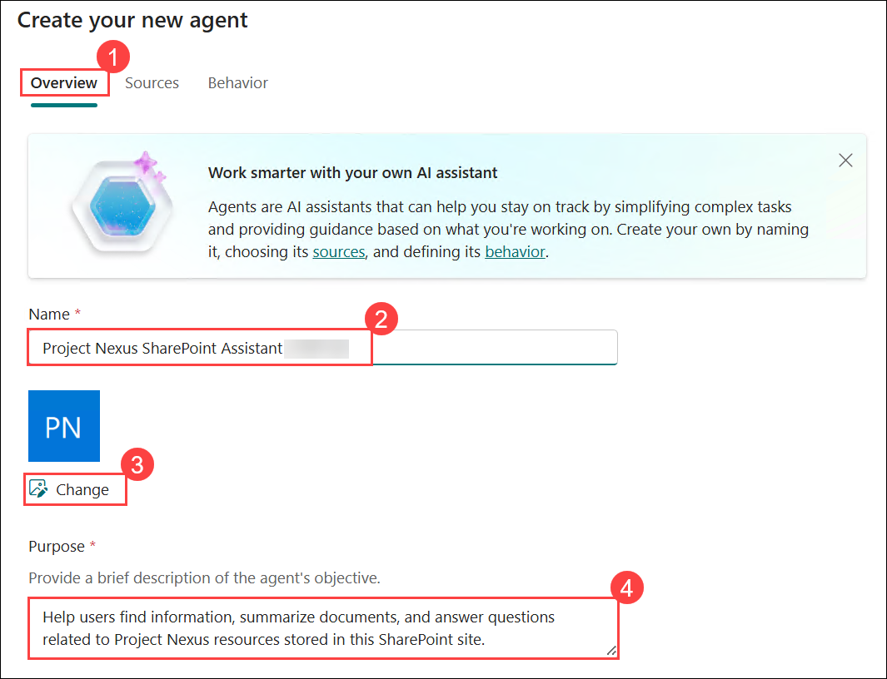

1. Select the **Sources** tab. The default source for a SharePoint agent is the entire SharePoint site associated with the agent. If you want the agent to reference more specific content, you can choose to use individual document libraries, folders, or files as sources.

1. Expand the SharePoint site by clicking the **expand icon (1)** next to **Project Nexus Knowledge Center**. You will see **Documents (2)** from the **Documents library** listed as the knowledge source for the agent. The Project Nexus files that you uploaded in the previous task will be used by the agent to generate responses. This configuration enables the agent to reference the content available in the site’s Documents library.

    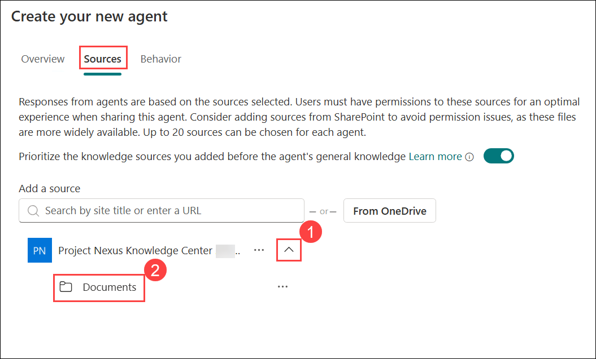

1. You can also add additional sources by selecting **From OneDrive** and choosing other files that you want the agent to reference. However, for the purpose of this lab, use only the Documents library of the site, which contains the files you uploaded earlier.

1. Now select the **Behavior** tab, and in the **Welcome messaging** field, enter the following message:

    ```
    Hello! I can help you find information and insights related to Project Nexus documents stored in this SharePoint site.
    ```

    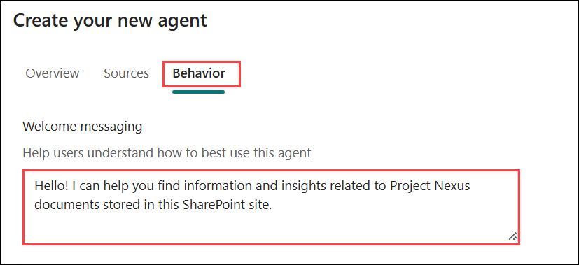

1. In the **Starter prompts** section, add the following prompts to help users quickly interact with the agent:

    - `Summarize the key documents available in this site.` **(1)**
    - `What risks are identified in the Project Nexus documentation?` **(2)**
    - `What insights are available about Project Nexus adoption?` **(3)**

        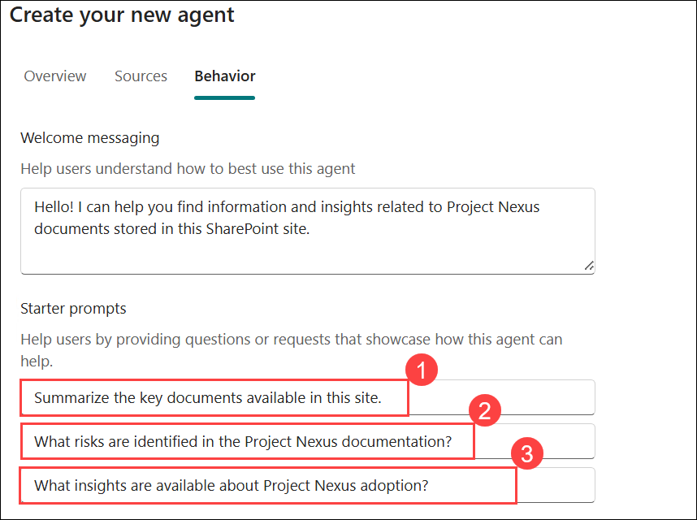

4. In the **Agent instructions** field, enter the following instruction **(1)** and then click **Create (2)** to create the agent.

    ```
    Use the SharePoint site content to answer questions about Project Nexus documents, summarize information, and provide insights based on the available files.
    ```

    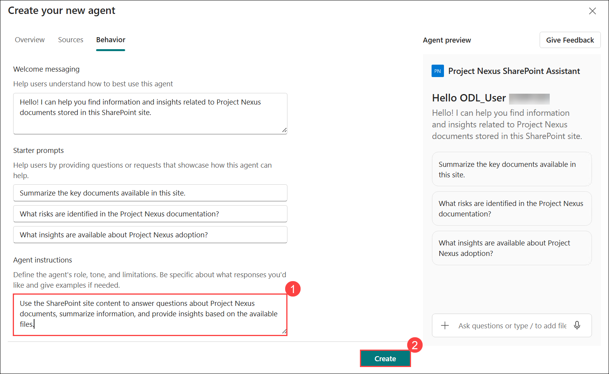

1. On the **Your agent is ready to use** dialog, click on **Chat with agent**.

    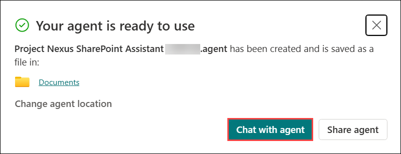

## Task 3: Test the SharePoint Copilot Agent

In this task, you will test the agent by submitting prompts related to the Project Nexus documents. You will verify that the agent generates responses using the information stored in the SharePoint site and provides insights, summaries, and answers based on the uploaded files.

1. A new browser tab opens displaying your newly created agent. You can also locate and select **Project Nexus SharePoint Assistant** from the **Agents** section in the left navigation pane to begin interacting with the agent.

    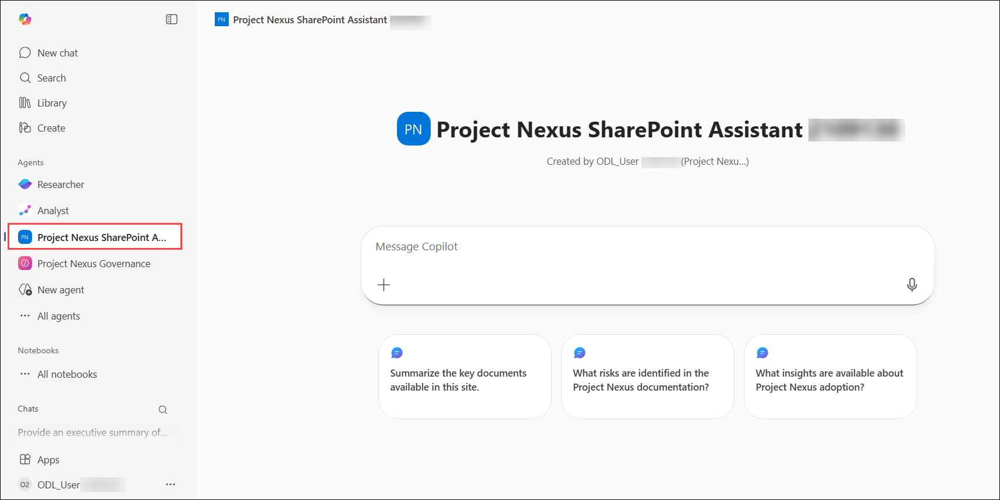

1. Select the **Summarize the key documents available in this site (1)** starter prompt, verify that the prompt appears in the message box **(2)**, and then click the **Send icon (3)** to submit the prompt and test the agent.

    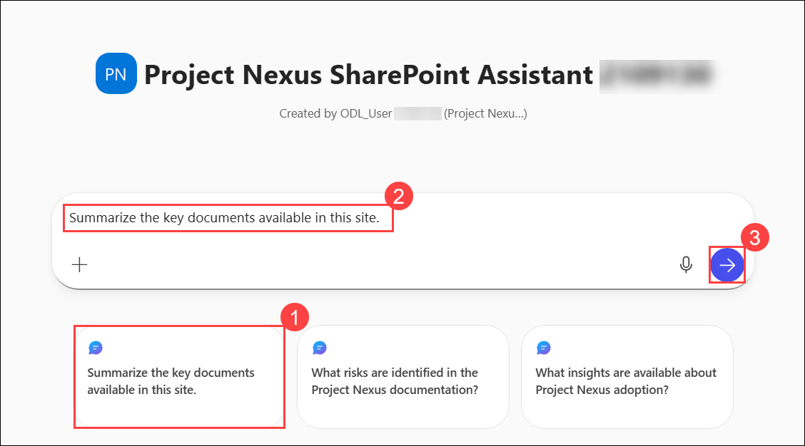

1. After submitting the prompt, review the response generated by the agent. The agent analyzes the documents stored in the SharePoint site and provides a structured summary of the key files, including highlights, insights, and important information extracted from the uploaded Project Nexus documents. This confirms that the agent is successfully using the SharePoint document library as its knowledge source.

    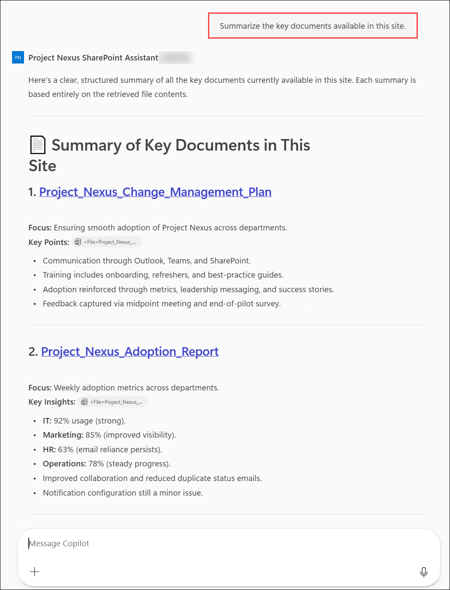

1. In the message box, enter the following prompt and submit the query. Review the response generated by the agent, which identifies and summarizes the risks extracted from the Project Nexus documents stored in the SharePoint site. This confirms that the agent can analyze the uploaded files and return relevant insights based on the document content.

    ```
    What risks are mentioned in the Project Nexus documents?
    ```

    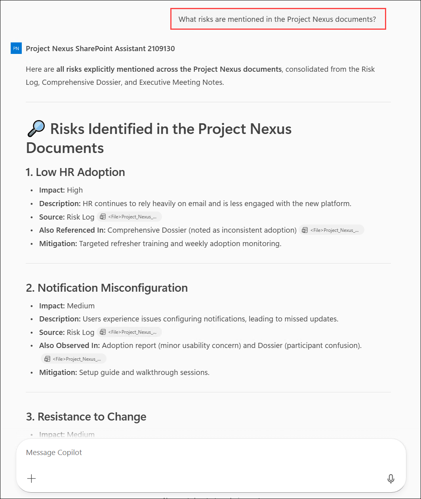

    > **Note:** The responses generated by Copilot agents may vary depending on the prompt interpretation and the available data. As a result, the output you receive may differ from the examples shown in the images.

1. Now enter the following prompt and submit the query:

    ```
    Provide an overview of Project Nexus readiness for enterprise rollout.
    ```

1. Review the response generated by the agent. The agent analyzes the uploaded Project Nexus documents and provides a consolidated overview of the project's readiness for enterprise deployment, including adoption metrics, strengths, concerns, and change management readiness. This demonstrates how the SharePoint agent can synthesize information from multiple documents to deliver meaningful insights.

    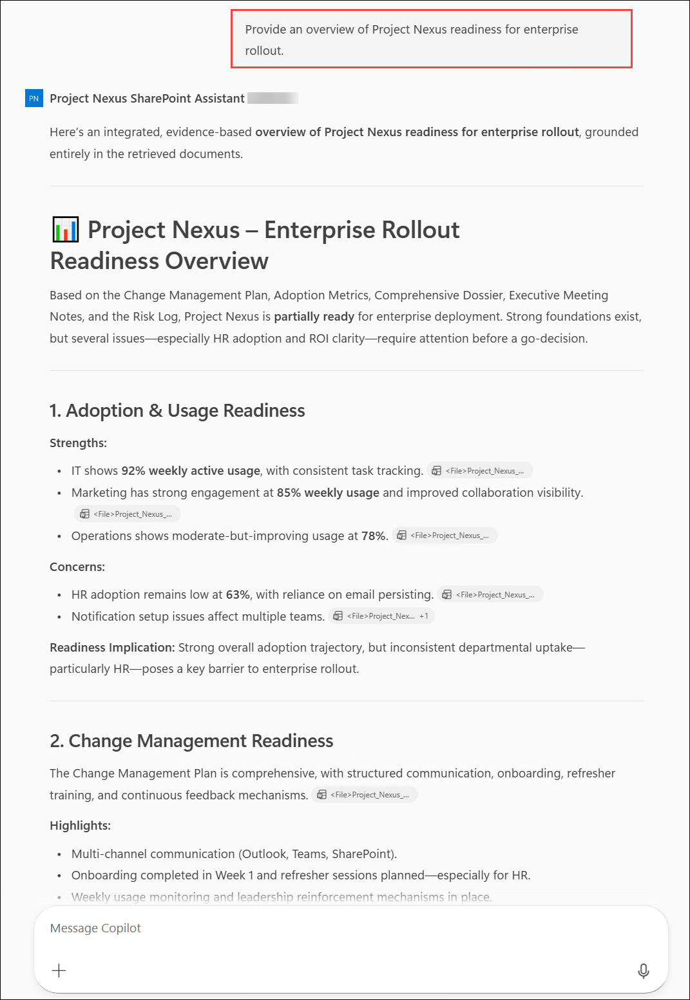

    > **Note:** The responses generated by Copilot agents may vary depending on the prompt interpretation and the available data. As a result, the output you receive may differ from the examples shown in the images.

1. This verifies that the responses are generated using information from the SharePoint documents you uploaded.

1. If you want to make changes to the agent, select the **ellipsis (...) (1)** next to the agent name in the left pane, and then select **Edit (2)**. This opens the **Edit agent** window, where you can modify the agent’s settings as needed.

    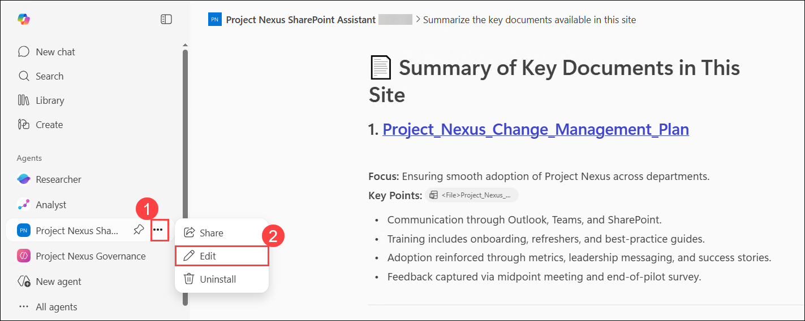

    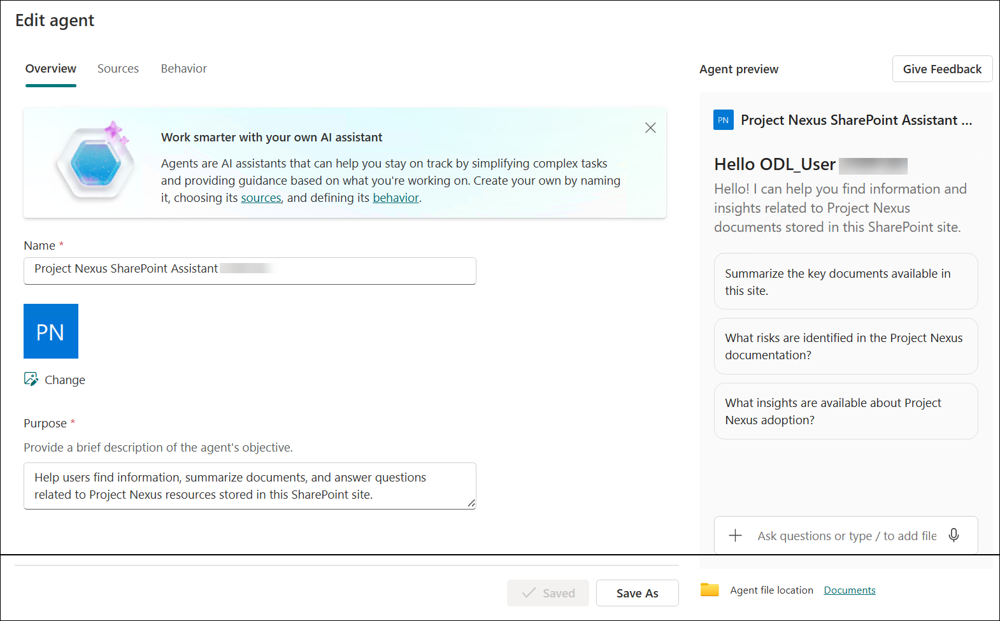

1. Return to the browser tab where the SharePoint site **Project Nexus Knowledge Center <inject key="DeploymentID"></inject>** is still open. From the top-right corner of the SharePoint page, select the **Open agents** icon. This opens the Copilot agent panel on the right side of the site, allowing you to interact with the agent directly from within the SharePoint site.

    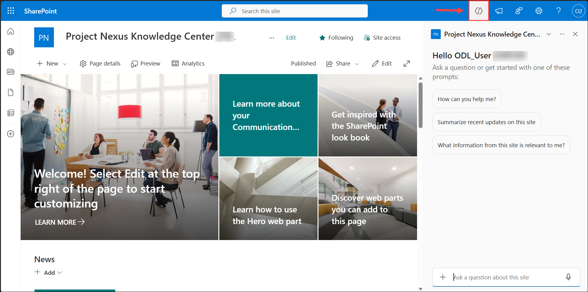

## Summary

In this lab, you created a **SharePoint Communication site** and uploaded Project Nexus documents that serve as the knowledge base for an AI-powered assistant. You then created a **SharePoint-connected Copilot agent** and configured it to use the site’s document library as its primary knowledge source. After configuring the agent’s behavior, prompts, and instructions, you tested the agent by asking questions related to the uploaded documents. This exercise demonstrates how **Microsoft 365 Copilot agents can transform SharePoint sites into intelligent knowledge assistants**, enabling users to quickly access insights, summarize documents, and retrieve relevant information from organizational content.

### You've successfully completed the Hand's-on lab!

