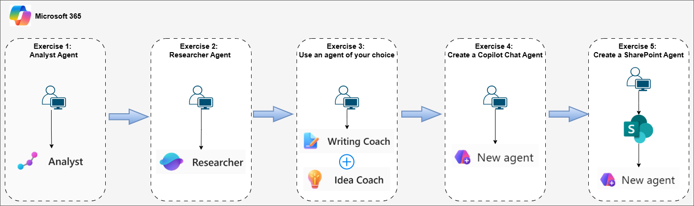
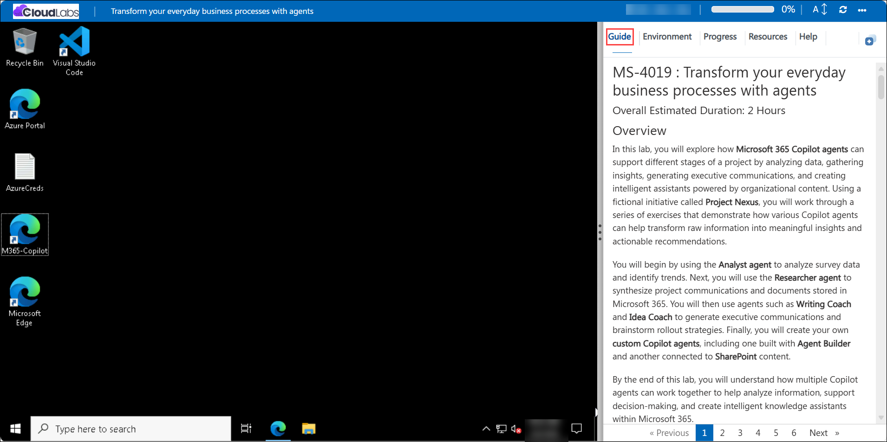
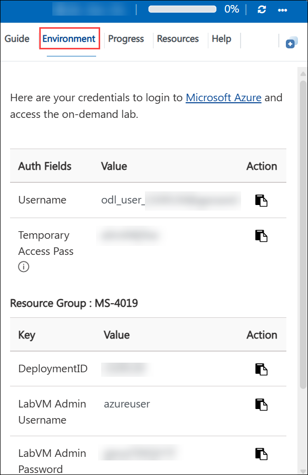
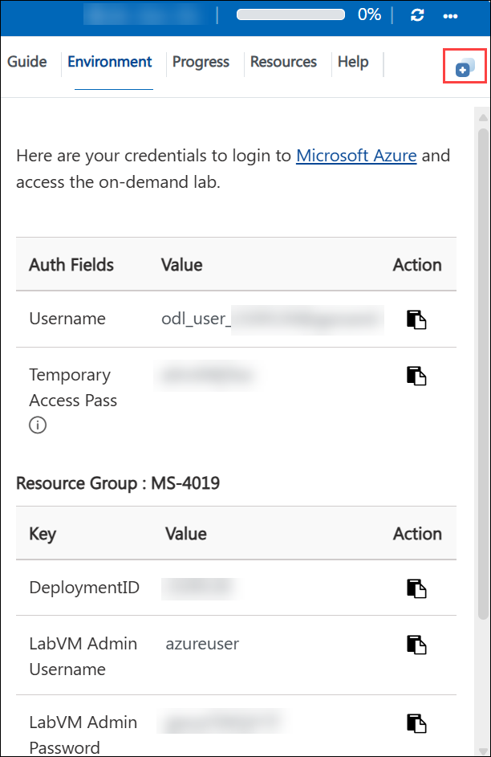
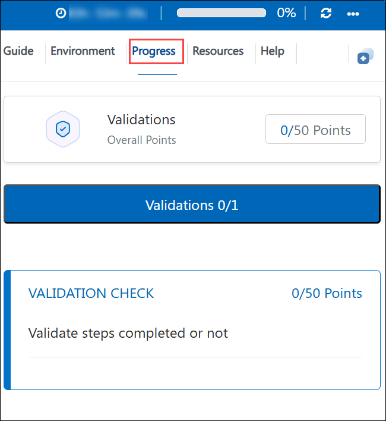
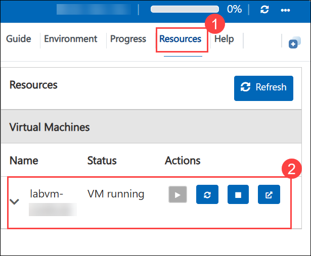
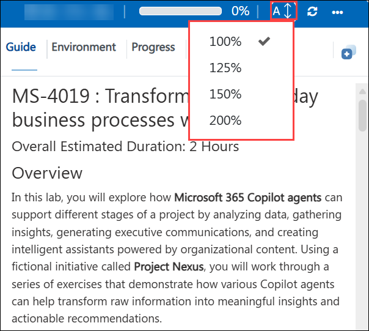
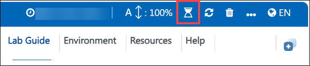
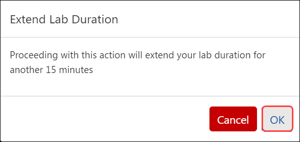

# MS-4019 : Transform your everyday business processes with agents

### Overall Estimated Duration: 2 Hours

## Overview

In this lab, you will explore how **Microsoft 365 Copilot agents** can support different stages of a project by analyzing data, gathering insights, generating executive communications, and creating intelligent assistants powered by organizational content. Using a fictional initiative called **Project Nexus**, you will work through a series of exercises that demonstrate how various Copilot agents can help transform raw information into meaningful insights and actionable recommendations.

You will begin by using the **Analyst agent** to analyze survey data and identify trends. Next, you will use the **Researcher agent** to synthesize project communications and documents stored in Microsoft 365. You will then use agents such as **Writing Coach** and **Idea Coach** to generate executive communications and brainstorm rollout strategies. Finally, you will create your own **custom Copilot agents**, including one built with **Agent Builder** and another connected to **SharePoint** content.

By the end of this lab, you will understand how multiple Copilot agents can work together to help analyze information, support decision-making, and create intelligent knowledge assistants within Microsoft 365.

## Objectives

By the end of this lab, you will be able to:

- **Analyze survey data using the Analyst agent:** Learn how to use the Microsoft 365 Copilot **Analyst** agent to interpret structured datasets, identify trends, calculate key metrics, and generate visualizations that transform raw survey responses into actionable insights.

- **Synthesize project communications using the Researcher agent:** Use the **Researcher** agent to gather and consolidate information from Microsoft 365 sources such as emails, meetings, Teams conversations, and OneDrive documents to generate summaries, extract action items, and uncover project insights.

- **Generate executive communications with Copilot agents:** Leverage the **Writing Coach** agent to create structured executive reports, recommendation summaries, emails, and briefing documents that communicate project outcomes and business value to leadership.

- **Brainstorm strategic ideas using the Idea Coach agent:** Use the **Idea Coach** agent to explore creative strategies for improving adoption, addressing project challenges, and planning enterprise rollout initiatives for Project Nexus.

- **Build a custom Copilot agent using Agent Builder:** Design and configure a custom Microsoft 365 Copilot agent grounded in project documentation that can analyze organizational data and generate decision-focused insights for executive stakeholders.

- **Create a SharePoint-connected Copilot agent:** Learn how to connect a Copilot agent to a SharePoint site so it can reference site content and documents to answer questions, summarize information, and act as an intelligent knowledge assistant.

- **Test and validate Copilot agent responses:** Verify that Copilot agents generate responses based on the provided project data and documents, ensuring that insights and recommendations are relevant, contextual, and decision-focused.
  
## Pre-requisites

- **Basic familiarity with Microsoft 365:** Understanding how to navigate Microsoft 365 apps such as OneDrive, SharePoint, Outlook, and Teams.

- **Access to Microsoft 365 Copilot:** A Microsoft 365 tenant with Copilot enabled to interact with Copilot agents such as Analyst, Researcher, Writing Coach, and Idea Coach.

- **Basic understanding of data analysis concepts:** Familiarity with interpreting survey results, identifying trends, and reviewing insights generated from structured data.

- **Basic knowledge of SharePoint and document libraries:** Understanding how to upload files, navigate SharePoint sites, and manage documents within a site.

- **General awareness of AI-assisted tools:** Familiarity with using AI assistants to generate summaries, insights, and recommendations using natural language prompts.

## Architecture

In this lab, the workflow demonstrates how **Microsoft 365 Copilot agents** can analyze data, synthesize information, and generate insights using organizational content from Microsoft 365. The process begins by using the **Analyst agent** to analyze a Project Nexus survey dataset and identify key trends and visual insights. Next, the **Researcher agent** gathers and synthesizes information from Microsoft 365 sources such as OneDrive documents, emails, meetings, and Teams conversations. You will then use the **Writing Coach** and **Idea Coach** agents to generate executive communications and brainstorm strategies for the Project Nexus rollout. Finally, you will create intelligent assistants by building a **custom Copilot agent using Agent Builder** and a **SharePoint-connected Copilot agent** that uses SharePoint documents as its knowledge source to answer questions and provide insights.

## Architecture Diagram

  

## Explanation of Components

- **Analyst Agent:** An AI-powered Copilot agent designed to analyze structured datasets. It can identify trends, calculate metrics, generate visualizations, and provide insights based on spreadsheet data.

- **Researcher Agent:** A Copilot agent that gathers and synthesizes information from Microsoft 365 sources such as Outlook emails, Teams chats, meetings, and OneDrive documents to generate summaries and insights.

- **Writing Coach Agent:** A Copilot agent that helps create polished written content, including executive reports, emails, summaries, and briefing documents tailored for leadership communication.

- **Idea Coach Agent:** A Copilot agent that assists with brainstorming and idea generation. It helps users develop strategies, explore solutions, and plan initiatives such as enterprise rollouts or adoption improvements.

- **Agent Builder:** A tool within Microsoft 365 Copilot that enables users to create custom AI agents by defining instructions, knowledge sources, and suggested prompts tailored to specific business scenarios.

- **SharePoint Communication Site:** A SharePoint site designed for sharing information across an organization. In this lab, it serves as a centralized location for storing Project Nexus documents used by Copilot agents.

- **SharePoint Document Library:** A storage location within a SharePoint site used to manage files and documents. The Copilot agent uses the files stored in the library as its knowledge source.

- **Custom Copilot Agent:** A user-created AI assistant configured with specific instructions, prompts, and knowledge sources to provide contextual insights and recommendations based on organizational data.

- **SharePoint-Connected Copilot Agent:** A Copilot agent that uses SharePoint site content and documents as its knowledge source, enabling users to ask questions and retrieve insights directly from stored organizational content.

## Getting Started with the Lab

Welcome to your MS-4019 : Transform your everyday business processes with agents workshop! We've prepared a seamless environment for you to explore and learn Azure Services. Let's begin by making the most of this experience:

## Accessing Your Lab Environment
Once you're ready to dive in, your virtual machine and **Guide** will be right at your fingertips within your web browser.

## Virtual Machine & Lab Guide

Your virtual machine is your workhorse throughout the workshop. The lab guide is your roadmap to success.

## Exploring your Lab Resources

To get the lab environment details, you can select the **Environment** tab. Additionally, the credentials will also be emailed to your registered email address.

## Utilizing the Split Window Feature

For convenience, you can open the lab guide in a separate window by selecting the **Split Window** button from the top right corner.

## Lab Progress

You can use the **Progress** tab to track your progress while working on the lab. A score will be provided after successful validation.

## Managing Your Virtual Machine
 
Feel free to **Start, Restart, or Stop** **(2)** your virtual machine as needed from the **Resources (1)** tab. Your experience is in your hands!

   

## Lab Guide Zoom In/Zoom Out Options

To adjust the zoom level for the environment page, click the A↕ : 100% icon located next to the timer in the lab environment.

   

## Lab Duration Extension

1. To extend the duration of the lab, kindly click the **Hourglass** icon in the top right corner of the lab environment. 

    

    >**Note:** You will get the **Hourglass** icon when 10 minutes are remaining in the lab.

2. Click **OK** to extend your lab duration.
 
   

3. If you have not extended the duration prior to when the lab is about to end, a pop-up will appear, giving you the option to extend. Click **OK** to proceed. 

## Support Contact

The CloudLabs support team is available 24/7, 365 days a year, via email and live chat to ensure seamless assistance at any time. We offer dedicated support channels tailored specifically for both learners and instructors, ensuring that all your needs are promptly and efficiently addressed.

Learner Support Contacts:

- Email Support: cloudlabs-support@spektrasystems.com
- Live Chat Support: https://cloudlabs.ai/labs-support

Now, click on **Next** from the lower right corner to move on to the next page.
   
   

## Happy Learning!!